# 🎯 AGENTIC AI THEORY: Foundations of Agent Orchestration

> **Master Document:** Theoretical foundation for designing robust, scalable, and observable agentic AI systems.  
> **Technology Stack:** LangChain, LangGraph, LangSmith, Pydantic  
> **Paradigm Shift:** From Simple Chatbots to Production-Ready Multi-Agent Systems  
> **Last Updated:** February 2026

---

## 📚 TABLE OF CONTENTS

1. [Genesis: From LLM to Agent](#1-genesis-from-llm-to-agent)
2. [Agentic AI: Foundational Theory](#2-agentic-ai-foundational-theory)
3. [Agent Orchestration: Definition and Purpose](#3-agent-orchestration-definition-and-purpose)
4. [Foundational Papers](#4-foundational-papers)
5. [Orchestration Architectures](#5-orchestration-architectures)
6. [Critical Components](#6-critical-components)
7. [Paradigm Evolution](#7-paradigm-evolution)
8. [Traditional RAG vs. Agentic RAG](#8-traditional-rag-vs-agentic-rag)
9. [Design Principles](#9-design-principles)
10. [Common Anti-Patterns](#10-common-anti-patterns)
11. [Metrics and Evaluation](#11-metrics-and-evaluation)
12. [**LangGraph & DAG-Based Orchestration**](#12-langgraph--dag-based-orchestration) ⭐ NEW
13. [**RAG Patterns in Multi-Agent Systems**](#13-rag-patterns-in-multi-agent-systems) ⭐ NEW
14. [**Implementation Patterns from Production**](#14-implementation-patterns-from-production) ⭐ NEW
15. [References](#15-references)

---

## 1. GENESIS: From LLM to Agent

### 1.1 The Philosopher vs. The Scientist Metaphor

The fundamental distinction between a Large Language Model (LLM) and an Agent lies in their capability scope:

| **Pure LLM (Philosopher in a Room)** | **Agent (Scientist in a Laboratory)** |
|--------------------------------------|----------------------------------------|
| Can only **reason** about trained knowledge | Can **reason** + **experiment** (tools) |
| Single-pass response | Iterative process based on observations |
| No memory between interactions | Persistent state and memory |
| Static knowledge (training cutoff) | Real-time information access |
| Cannot self-correct | Self-correction via feedback loops |
| Passive responder | Active problem solver |

**Key Insight:** An LLM becomes an Agent when it gains:
1. **Perception** (ability to observe/read from environment)
2. **Action** (ability to execute tools/functions)
3. **Memory** (ability to maintain state across iterations)
4. **Autonomy** (ability to decide when/what to do)

### 1.2 The Agentic Loop (ReAct Pattern)


**Core Concept:** The LLM generates "internal reasoning" (Chain of Thought) **before** deciding which tool to execute. This reduces hallucinations and improves accuracy.

### 1.3 Three Pillars of Agency

1. **Reasoning (Cognitive Layer)**
   - Planning and strategy formulation
   - Hypothesis generation
   - Causal inference
   - Goal decomposition

2. **Acting (Execution Layer)**
   - Tool selection and invocation
   - Environment manipulation
   - Data retrieval and transformation
   - Side-effect management

3. **Learning (Adaptation Layer)**
   - Feedback processing
   - Strategy refinement
   - Error correction
   - Performance optimization

---

## 2. AGENTIC AI: Foundational Theory

### 2.1 Core Architectural Paradigms

Modern agentic systems are built on three architectural foundations:

#### A. Symbolic/Classical Agentic Systems

**Characteristics:**
- Rule-based reasoning
- Explicit planning algorithms (STRIPS, HTN)
- Persistent, structured state (knowledge graphs, databases)
- Deterministic behavior

**Advantages:**
- Transparent decision-making
- Predictable outcomes
- Easy to audit and debug
- Suitable for safety-critical domains

**Use Cases:**
- Healthcare diagnosis systems
- Financial compliance checking
- Industrial process control

#### B. Neural/Generative Agentic Systems

**Characteristics:**
- LLM-driven reasoning
- Stochastic generation
- Prompt-based orchestration
- Flexible memory management

**Advantages:**
- Adaptive to novel situations
- Natural language understanding
- Quick deployment
- Handles ambiguity well

**Use Cases:**
- Customer service automation
- Creative content generation
- Research assistance

#### C. Hybrid Neuro-Symbolic Systems

**Characteristics:**
- Combines explicit rules with learned behaviors
- Symbolic planning with neural execution
- Structured knowledge + unstructured text
- Verifiable outputs with flexible inputs

**Advantages:**
- Best of both paradigms
- Explainable AI with adaptability
- Robust to edge cases
- Scalable and maintainable

**Use Cases:**
- Legal document analysis
- Scientific research automation
- Complex enterprise workflows

### 2.2 The Four Pillars of Agentic AI

Based on contemporary research and industry best practices:


#### Pillar 1: Memory Hierarchy

**Short-term Memory (Working Memory):**
- Context window content
- Current conversation/session
- Immediate observations
- Temporary variables

**Long-term Memory (Knowledge Base):**
- Vector databases (RAG)
- Structured knowledge graphs
- Historical interaction logs
- Learned preferences

**Episodic Memory (Experience Buffer):**
- Task execution history
- Success/failure patterns
- Reflection summaries
- Performance metrics

#### Pillar 2: Reasoning Engine

**Planning:**
- Goal decomposition
- Strategy formulation
- Resource allocation
- Risk assessment

**Reflection:**
- Self-evaluation
- Alternative generation
- Critique and refinement
- Meta-cognition

**Self-Correction:**
- Error detection
- Recovery strategies
- Learning from failures
- Continuous improvement

#### Pillar 3: Tool Ecosystem

**Categories:**
- **Information Retrieval:** Search engines, databases, APIs
- **Computation:** Calculators, code interpreters, simulators
- **Action:** Email senders, file managers, workflow triggers
- **Observation:** Sensors, monitors, log readers

**Tool Selection Strategies:**
- Semantic similarity (embedding-based)
- Rule-based routing
- LLM-as-judge
- Learned selection (RL)

#### Pillar 4: Governance Layer

**Safety Constraints:**
- Action allowlists/denylists
- Resource limits (time, cost, API calls)
- Input/output validation
- Sandboxing

**Observability:**
- Execution tracing (LangSmith, LangFuse)
- Performance monitoring
- Cost tracking
- Error logging

**Human-in-the-Loop:**
- Approval gates for critical actions
- Escalation protocols
- Feedback collection
- Override mechanisms

### 2.3 Autonomy Spectrum

Agentic systems exist on a continuum of autonomy:


**Design Consideration:** Match autonomy level to:
- Task criticality (high stakes → lower autonomy)
- Environment predictability (chaotic → lower autonomy)
- User expertise (novice users → lower autonomy)
- Regulatory requirements (compliance → lower autonomy)

---

## 3. AGENT ORCHESTRATION: Definition and Purpose

### 3.1 Technical Definition

> **Agent Orchestration** is the architectural pattern that coordinates the execution of multiple specialized agents, managing:
> - **Control flow** (who executes what and when)
> - **Shared state** (common memory and context)
> - **Inter-agent communication** (message passing/data exchange)
> - **Dynamic routing** (conditional branching based on state)

### 3.2 Metaphor: The Orchestra Conductor

Imagine a symphony orchestra:

| **Musical Element** | **Technical Component** |
|---------------------|-------------------------|
| Musicians (violin, piano, drums) | Specialized agents (SearchAgent, SQLAgent, AnalysisAgent) |
| Musical score | StateGraph (LangGraph) |
| Conductor | Orchestrator/Router |
| Performance | Graph execution |
| Resulting symphony | Coherent, complex output |

**Without Orchestrator:** Each musician plays independently → Chaos  
**With Orchestrator:** Perfect synchronization → Coherent symphony

### 3.3 Why Orchestration is Necessary

#### Problem 1: Specialization vs. Generalization Trade-off


#### Problem 2: Complex Tasks Require Decomposition

```mermaid
flowchart TD
    A[Task: Analyze Q4 2025 sales<br/>and predict Q1 2026] --> B{Orchestration?}
    B -->|Without| C[One agent does everything]
    C --> D[❌ FAILURE]
    B -->|With| E[DataAgent:<br/>Extract from DB]
    E --> F[AnalysisAgent:<br/>Calculate metrics]
    F --> G[ForecastAgent:<br/>Generate prediction]
    G --> H[ReportAgent:<br/>Format output]
    H --> I[✅ SUCCESS]
    
    style D fill:#dc2626,stroke:#f87171,color:#fff
    style I fill:#16a34a,stroke:#4ade80,color:#fff
```



#### Problem 3: Iteration and Self-Correction

Single-pass execution is fragile. Orchestration enables:
- **Retry loops** with modified parameters
- **Critic agents** that evaluate and improve outputs
- **Multi-stage refinement** (draft → review → final)
- **Adaptive routing** based on intermediate results

### 3.4 Orchestration Complexity Levels

| **Level** | **Description** | **Example** |
|-----------|-----------------|-------------|
| **L0: No Orchestration** | Single LLM call | Simple Q&A chatbot |
| **L1: Linear Chain** | Sequential steps, no branching | RAG pipeline |
| **L2: Conditional Routing** | If-else logic, one agent per branch | Intent classification → specialist |
| **L3: Cyclic Workflows** | Loops with termination conditions | Code generation with tests |
| **L4: Dynamic Multi-Agent** | Agents spawn/coordinate on-the-fly | Market simulation with adaptive traders |

---

## 4. FOUNDATIONAL PAPERS

### 4.1 ReAct: Synergizing Reasoning and Acting (2022)

**Full Citation:**
```
Yao, S., Zhao, J., Yu, D., Du, N., Shafran, I., Narasimhan, K., & Cao, Y. (2022).
ReAct: Synergizing Reasoning and Acting in Language Models.
arXiv preprint arXiv:2210.03629.
```

**What It Solves:**  
LLMs making decisions without access to current information or external tools.

**Innovation:**  
Alternates **reasoning** (Thought) with **actions** (Tool calls) in an iterative loop.

**Architecture:**


**Performance Gains:**
- HotpotQA: 27% → 34% accuracy (+26% relative improvement)
- Fever: 56% → 61% F1 score
- ALFWorld: 34% → 71% success rate

**Application:**  
Foundation of LangChain Agents, AutoGPT, BabyAGI, and all modern agentic frameworks.

**Code Example (Simplified):**
```python
def react_loop(query, max_iterations=5):
    context = [query]
    
    for i in range(max_iterations):
        # Reasoning step
        thought = llm.generate(context, prompt="Think step by step")
        
        if "FINAL ANSWER:" in thought:
            return extract_answer(thought)
        
        # Acting step
        action = extract_action(thought)  # e.g., "Search[Barcelona weather]"
        observation = execute_tool(action)
        
        # Update context
        context.extend([thought, observation])
    
    return "Max iterations reached"
```

---

### 4.2 Toolformer: Language Models Can Teach Themselves to Use Tools (2023)

**Full Citation:**
```
Schick, T., Dwivedi-Yu, J., Dessì, R., Raileanu, R., Lomeli, M., Zettlemoyer, L.,
Cancedda, N., & Scialom, T. (2023).
Toolformer: Language Models Can Teach Themselves to Use Tools.
arXiv preprint arXiv:2302.04761.
```

**What It Solves:**  
LLMs don't know **when** they need tools (overuse or underuse).

**Innovation:**  
Fine-tuning approach where models learn to insert `<tool>` tokens autonomously via self-supervised learning.

**Example:**
```
Before: "The capital of France is [hallucinates wrong answer]"
After:  "The capital of France is <tool>search('capital of France')</tool> Paris"
```

**Training Process:**
1. LLM generates candidate tool calls for a corpus
2. Execute tools and measure perplexity improvement
3. Keep only helpful tool calls
4. Fine-tune on filtered dataset

**Application:**
- OpenAI Function Calling
- Claude Tool Use
- Gemini Function Calling
- All modern "function-calling" LLMs

---

### 4.3 Generative Agents: Interactive Simulacra of Human Behavior (2023)

**Full Citation:**
```
Park, J. S., O'Brien, J. C., Cai, C. J., Morris, M. R., Liang, P., & Bernstein, M. S. (2023).
Generative Agents: Interactive Simulacra of Human Behavior.
In Proceedings of the 2023 CHI Conference on Human Factors in Computing Systems.
arXiv preprint arXiv:2304.03442.
```

**What It Solves:**  
Agents without memory exhibit incoherent, non-human-like behavior over time.

**Innovation:**  
Three-tier memory architecture:


**Memory Operations:**

1. **Observation Stream:**
   - Timestamped events
   - Raw sensory input
   - Decay with time

2. **Reflection (Periodic):**
   - "What are the 3 most important patterns I've noticed?"
   - Generate higher-level insights
   - Store as synthetic memories

3. **Planning (Goal-driven):**
   - "Given my current state and goals, what should I do?"
   - Generate action sequences
   - Update based on outcomes

**Retrieval Strategy:**
```
relevance_score = (recency × w1) + (importance × w2) + (relevance × w3)
```

**Application:**
- Simulation environments ("The Sims" with LLMs)
- Long-term personal assistants
- Multi-session conversational agents
- Training data generation for RL

---

### 4.4 AlphaCodium: From Prompt Engineering to Flow Engineering (2024)

**Full Citation:**
```
Ridnik, T., Kredo, D., & Friedman, I. (2024).
Code Generation with AlphaCodium: From Prompt Engineering to Flow Engineering.
arXiv preprint arXiv:2401.08500.
```

**What It Solves:**  
Single-shot code generation is brittle and prone to errors.

**Innovation:**  
**Flow Engineering** = Designing the reasoning process as an iterative graph.

**Pipeline:**


**Key Stages:**

1. **Problem Understanding**
   - Natural language → Formal specification
   - Generate public + private test cases
   - Identify edge cases

2. **Initial Solution**
   - Generate baseline code
   - Deliberately simple (prioritize correctness over optimization)

3. **Iterative Refinement**
   - Run tests
   - Analyze errors (syntax, logic, edge cases)
   - Generate fixes
   - Repeat until convergence

**Performance Metrics:**
- CodeContests: 19% → 44% pass@1 (132% improvement)
- Optimal iterations: 8-10 for complex problems
- Diminishing returns after 15 iterations

**Application:**
- LangGraph StateGraph for complex tasks
- Automated debugging systems
- TDD-based code generation
- Competition programming

---

## 5. ORCHESTRATION ARCHITECTURES

### 5.1 Sequential (Chain) Pattern

**Description:**  
Linear pipeline where each agent's output becomes the next agent's input.

**Diagram:**


**Characteristics:**
- Deterministic, unidirectional flow
- Each agent depends on previous outputs
- No conditional branching
- Simple to debug and trace

**When to Use:**
- Traditional RAG: `Retrieve → Rerank → Generate`
- ETL pipelines: `Extract → Transform → Load`
- Document processing: `Parse → Analyze → Format`

**Code Example:**
```python
from langgraph.graph import StateGraph, END
from typing import TypedDict

class ChainState(TypedDict):
    query: str
    documents: list
    summary: str
    formatted_output: str

def research_agent(state: ChainState) -> ChainState:
    state["documents"] = search_tool(state["query"])
    return state

def summarize_agent(state: ChainState) -> ChainState:
    state["summary"] = llm.invoke(f"Summarize: {state['documents']}")
    return state

def format_agent(state: ChainState) -> ChainState:
    state["formatted_output"] = format_as_markdown(state["summary"])
    return state

# Build graph
workflow = StateGraph(ChainState)
workflow.add_node("research", research_agent)
workflow.add_node("summarize", summarize_agent)
workflow.add_node("format", format_agent)

workflow.add_edge("research", "summarize")
workflow.add_edge("summarize", "format")
workflow.add_edge("format", END)

workflow.set_entry_point("research")
app = workflow.compile()
```

**Advantages:**
- ✅ Simple to understand and implement
- ✅ Easy to test individual components
- ✅ Clear data flow
- ✅ Minimal coordination overhead

**Disadvantages:**
- ❌ No flexibility in execution path
- ❌ Cannot skip or reroute steps
- ❌ Single point of failure (if one agent fails, entire pipeline fails)
- ❌ No parallelization opportunities

---

### 5.2 Router (Triage) Pattern

**Description:**  
Central router classifies the request and dispatches to the most appropriate specialist agent.

**Diagram:**


**Characteristics:**
- Conditional routing based on input classification
- Only one specialist executes per request
- Domain specialization
- Centralized decision-making

**When to Use:**
- Intent classification: "Is this about DB, Web, or Images?"
- Customer service triage: Route to appropriate support team
- Multi-domain systems: Different experts for different topics
- Load balancing: Distribute work across agent pools

**Routing Strategies:**

1. **Semantic Routing (Embedding-based):**
```python
from langchain.embeddings import OpenAIEmbeddings
import numpy as np

embeddings = OpenAIEmbeddings()

agent_descriptors = {
    "sql_agent": "Questions about databases, queries, data analysis",
    "web_agent": "Questions requiring internet search, news, current events",
    "vision_agent": "Questions about images, photos, visual content"
}

def semantic_route(query: str) -> str:
    query_emb = embeddings.embed_query(query)
    
    best_agent = None
    best_score = -1
    
    for agent, desc in agent_descriptors.items():
        desc_emb = embeddings.embed_query(desc)
        similarity = np.dot(query_emb, desc_emb)
        
        if similarity > best_score:
            best_score = similarity
            best_agent = agent
    
    return best_agent
```

2. **LLM-based Routing:**
```python
def llm_route(state: AgentState) -> str:
    query = state["messages"][-1].content
    
    routing_prompt = f"""Given this query: "{query}"
    
    Which agent should handle it?
    - sql_agent: Database queries and data analysis
    - web_agent: Internet search and current events
    - vision_agent: Image analysis and visual questions
    
    Respond with ONLY the agent name."""
    
    agent_name = llm.invoke(routing_prompt).content.strip()
    return agent_name
```

3. **Rule-based Routing:**
```python
def rule_based_route(state: AgentState) -> str:
    query = state["messages"][-1].content.lower()
    
    if any(kw in query for kw in ["database", "sql", "table", "query"]):
        return "sql_agent"
    elif any(kw in query for kw in ["search", "internet", "news", "latest"]):
        return "web_agent"
    elif any(kw in query for kw in ["image", "photo", "picture", "visual"]):
        return "vision_agent"
    else:
        return "general_agent"
```

**Advantages:**
- ✅ Easy to add new specialist agents
- ✅ Clear separation of concerns
- ✅ Efficient (only one agent executes)
- ✅ Scalable to many domains

**Disadvantages:**
- ❌ Router is a single point of failure
- ❌ Routing errors cascade to poor results
- ❌ No collaboration between agents
- ❌ Cannot handle multi-domain queries well

---

### 5.3 Hierarchical (Manager-Worker) Pattern

**Description:**  
Manager agent decomposes complex tasks into subtasks, delegates to specialized workers, then synthesizes results.

**Diagram:**


**Characteristics:**
- Task decomposition by manager
- Parallel execution of workers (when possible)
- Manager coordinates and synthesizes
- Tree-like structure (can nest managers)

**When to Use:**
- Complex tasks with multiple independent subtasks
- Research requiring multiple sources
- Multi-dimensional analysis
- Tasks requiring diverse expertise

**Example:**


**Implementation:**
```python
from typing import TypedDict, List
from langgraph.graph import StateGraph, END

class HierarchicalState(TypedDict):
    task: str
    subtasks: List[dict]
    worker_results: List[dict]
    final_report: str

def manager_decompose(state: HierarchicalState) -> HierarchicalState:
    """Manager breaks down task into subtasks"""
    task = state["task"]
    
    decomposition_prompt = f"""Task: {task}
    
    Decompose this into 3-5 independent subtasks that can be executed in parallel.
    Format as JSON list."""
    
    subtasks = llm.invoke(decomposition_prompt, response_format="json")
    state["subtasks"] = subtasks
    return state

def worker_execute(state: HierarchicalState, worker_id: int) -> HierarchicalState:
    """Worker executes assigned subtask"""
    subtask = state["subtasks"][worker_id]
    result = execute_subtask(subtask)  # Use appropriate tools
    
    state["worker_results"].append({
        "worker_id": worker_id,
        "subtask": subtask,
        "result": result
    })
    return state

def manager_synthesize(state: HierarchicalState) -> HierarchicalState:
    """Manager synthesizes worker results"""
    synthesis_prompt = f"""Subtask results: {state['worker_results']}
    
    Synthesize these into a comprehensive answer to: {state['task']}"""
    
    state["final_report"] = llm.invoke(synthesis_prompt)
    return state

# Build graph
workflow = StateGraph(HierarchicalState)
workflow.add_node("decompose", manager_decompose)
workflow.add_node("worker_1", lambda s: worker_execute(s, 0))
workflow.add_node("worker_2", lambda s: worker_execute(s, 1))
workflow.add_node("worker_3", lambda s: worker_execute(s, 2))
workflow.add_node("synthesize", manager_synthesize)

# Sequential: decompose → workers (parallel) → synthesize
workflow.add_edge("decompose", "worker_1")
workflow.add_edge("decompose", "worker_2")
workflow.add_edge("decompose", "worker_3")
workflow.add_edge(["worker_1", "worker_2", "worker_3"], "synthesize")
workflow.add_edge("synthesize", END)
```

**Advantages:**
- ✅ Natural task decomposition
- ✅ Parallelization opportunities
- ✅ Modular and extensible
- ✅ Clear responsibility hierarchy

**Disadvantages:**
- ❌ Manager bottleneck (decomposition and synthesis)
- ❌ Context management complexity
- ❌ Requires good task decomposition
- ❌ Overhead in coordination

---

### 5.4 Cyclic (Iterative Loop) Pattern

**Description:**  
Agents execute in a loop with evaluation/critique steps, iterating until quality criteria are met.

**Diagram:**


**Characteristics:**
- Iteration until convergence
- Self-correction via feedback loop
- Continuous quality evaluation
- Requires termination conditions

**When to Use:**
- Code generation with tests
- Iterative creative writing
- Output optimization
- Problems without obvious solutions
- High-stakes decisions requiring verification

**Anti-Loop-Infinity Protection:**
```python
from typing import TypedDict

class IterativeState(TypedDict):
    task: str
    current_output: str
    critique: str
    iterations: int
    max_iterations: int  # CRITICAL: Safety limit
    quality_score: float

def should_continue(state: IterativeState) -> str:
    """Routing function with safety checks"""
    
    # Safety: max iterations reached
    if state["iterations"] >= state["max_iterations"]:
        return "max_iterations_reached"
    
    # Success: quality threshold met
    if state["quality_score"] >= 0.9:
        return "success"
    
    # Edge case: no improvement in last 3 iterations
    if state["iterations"] > 3 and is_stagnant(state):
        return "stagnation"
    
    # Continue iterating
    return "continue"

# In graph definition
workflow.add_conditional_edges(
    "critic",
    should_continue,
    {
        "continue": "executor",
        "success": END,
        "max_iterations_reached": "fallback_handler",
        "stagnation": "fallback_handler"
    }
)
```

**Advanced Pattern: Reflection + Planning:**
```python
def reflection_loop():
    """AlphaCodium-style iterative refinement"""
    
    state = {
        "problem": "Write Python function to validate emails",
        "code": "",
        "test_results": [],
        "reflection": "",
        "iteration": 0,
        "max_iterations": 10
    }
    
    while state["iteration"] < state["max_iterations"]:
        # Step 1: Plan or revise
        if state["iteration"] == 0:
            state["code"] = initial_code_generation(state["problem"])
        else:
            state["code"] = refine_code(
                state["code"],
                state["test_results"],
                state["reflection"]
            )
        
        # Step 2: Execute tests
        state["test_results"] = run_tests(state["code"])
        
        # Step 3: Check success
        if all(result["passed"] for result in state["test_results"]):
            return state["code"]
        
        # Step 4: Reflect on failures
        state["reflection"] = generate_reflection(
            state["code"],
            state["test_results"]
        )
        
        state["iteration"] += 1
    
    return state["code"]  # Best attempt
```

**Advantages:**
- ✅ Self-improving outputs
- ✅ Handles complex/ambiguous tasks
- ✅ Learns from mistakes
- ✅ High-quality results

**Disadvantages:**
- ❌ Higher latency (multiple iterations)
- ❌ Increased cost (more LLM calls)
- ❌ Requires careful termination design
- ❌ Can get stuck in local optima

---

### 5.5 Reflection Pattern

**Description:**  
Specialized agents review and critique other agents' outputs before finalizing.

**Diagram:**


**When to Use:**
- High-stakes decisions (legal, medical)
- Creative content requiring polish
- Code review automation
- Fact-checking pipelines

**Multi-Critic Architecture:**


---

### 5.6 Parallel Execution Pattern

**Description:**  
Multiple agents execute simultaneously, then results are merged.

**Diagram:**


**When to Use:**
- Consensus-seeking (multiple LLMs vote)
- Multi-perspective analysis
- Redundancy for reliability
- Speed optimization (reduce latency)

---

### 5.7 Group Chat Pattern

**Description:**  
Agents communicate in a shared message thread, dynamically deciding who speaks next.

**Diagram:**


**When to Use:**
- Collaborative problem-solving
- Debate and consensus-building
- Dynamic role assignment
- Emergent behavior exploration

---

## 6. CRITICAL COMPONENTS

### 6.1 State Management (The Nervous System)

**Purpose:**  
Maintain shared context between agents to prevent information loss.

**Without State Management:**

```mermaid
flowchart LR
    A[Agent A:<br/>Found 5 results] --> B[Agent B:<br/>What results?<br/>❌ No context]
    
    style B fill:#dc2626,stroke:#f87171,color:#fff
```


**With State Management:**

```mermaid
flowchart LR
    A[Agent A:<br/>results = search<br/>state.results = results] --> B[Agent B:<br/>analyze state.results<br/>✅ Has context]
    
    style B fill:#16a34a,stroke:#4ade80,color:#fff
```


**State Schema Design:**
```python
from typing import TypedDict, Annotated, List, Dict, Optional
from operator import add
from datetime import datetime

class AgentState(TypedDict):
    # ========== CONVERSATION HISTORY ==========
    # Accumulator: Appends new messages
    messages: Annotated[List[dict], add]
    
    # ========== CONTROL FLOW ==========
    # Replace: Last value wins
    current_agent: str
    next_action: str
    
    # ========== SHARED DATA ==========
    # Custom: Merge dictionaries
    retrieved_docs: List[dict]
    analysis_results: Dict[str, any]
    
    # ========== SAFETY & LIMITS ==========
    iterations: int
    max_iterations: int
    error_count: int
    
    # ========== METADATA ==========
    timestamp: datetime
    user_id: str
    session_id: str
    
    # ========== QUALITY TRACKING ==========
    confidence_score: float
    validation_results: Optional[Dict]
```

**Reduction Operators:**

1. **Add (Accumulate):**
```python
# List accumulation
messages: Annotated[List, add]
# [a, b] + [c] = [a, b, c]
```

2. **Replace (Override):**
```python
# Simple replacement
current_agent: str
# "agent_a" → "agent_b"
```

3. **Custom (Merge):**
```python
def merge_dicts(left: Dict, right: Dict) -> Dict:
    """Deep merge strategy"""
    result = left.copy()
    for key, value in right.items():
        if key in result and isinstance(result[key], dict) and isinstance(value, dict):
            result[key] = merge_dicts(result[key], value)
        else:
            result[key] = value
    return result

analysis_results: Annotated[Dict, merge_dicts]
```

**State Persistence:**
```python
from langgraph.checkpoint import MemorySaver, SqliteSaver

# In-memory (ephemeral)
checkpointer = MemorySaver()

# Persistent (survives restarts)
checkpointer = SqliteSaver("checkpoints.db")

app = workflow.compile(checkpointer=checkpointer)

# Usage
config = {"configurable": {"thread_id": "user_123_session_456"}}
result = app.invoke(initial_state, config=config)

# Resume later
continued = app.invoke({"new_input": "..."}, config=config)
```

---

### 6.2 Control Flow (The Decision Map)

**Components:**

#### A. Nodes (Agents/Functions)
```python
def research_agent(state: AgentState) -> AgentState:
    """Execute research task"""
    query = state["messages"][-1]["content"]
    
    # Use tools
    results = web_search_tool(query)
    
    # Update state
    state["retrieved_docs"] = results
    state["current_agent"] = "research"
    state["timestamp"] = datetime.now()
    
    return state
```

#### B. Edges (Flow Transitions)

**Deterministic Edge:**
```python
workflow.add_edge("planner", "executor")
# Always goes from planner to executor
```

**Conditional Edge:**
```python
def route_after_executor(state: AgentState) -> str:
    """Decide next step based on state"""
    if state["error_count"] > 3:
        return "error_handler"
    elif state["confidence_score"] < 0.7:
        return "critic"
    elif state["iterations"] >= state["max_iterations"]:
        return END
    else:
        return "next_agent"

workflow.add_conditional_edges(
    "executor",
    route_after_executor,
    {
        "error_handler": "error_recovery",
        "critic": "critic_agent",
        END: END,
        "next_agent": "finalizer"
    }
)
```

#### C. Entry Point
```python
workflow.set_entry_point("planner")
# Or conditional entry
workflow.set_conditional_entry_point(
    route_entry,
    {
        "simple": "direct_answer",
        "complex": "planner"
    }
)
```

---

### 6.3 Observability (The Telemetry Dashboard)

**Metaphor:** LangSmith is like Formula 1 car telemetry.

**Dashboard Example:**
```
┌─────────────────────────────────────────────────────────────┐
│  TRACE ID: run_abc123                                       │
├─────────────────────────────────────────────────────────────┤
│  ├─ planner_agent                          2.3s ✓          │
│  │  ├─ llm_call (gpt-4)                   2.1s            │
│  │  │  ├─ prompt_tokens: 1,234                            │
│  │  │  ├─ completion_tokens: 456                          │
│  │  │  └─ cost: $0.021                                    │
│  │  └─ output: "Plan: 1. Search 2. Analyze"              │
│  │                                                          │
│  ├─ executor_agent                         5.1s ✓          │
│  │  ├─ tool: web_search                   4.8s  🔴        │
│  │  │  └─ ERROR: Timeout after 5s                         │
│  │  └─ retry: web_search                  4.2s ✓         │
│  │                                                          │
│  └─ critic_agent                           1.2s ✓          │
│     └─ decision: "Quality OK, end"                        │
├─────────────────────────────────────────────────────────────┤
│  TOTAL: 8.6s | COST: $0.032 | TOKENS: 3,245               │
│  SUCCESS RATE: 95% (19/20 recent runs)                     │
│  AVG LATENCY: 7.8s (p50: 6.2s, p95: 12.4s)                │
└─────────────────────────────────────────────────────────────┘
```

**Key Metrics:**
- **Latency:** Total time and per-node
- **Cost:** Tokens consumed × Model price
- **Success Rate:** % of runs without critical errors
- **Bottlenecks:** Slowest nodes (often tool calls with timeouts)

**Implementation:**
```python
from langsmith import Client
from langchain.callbacks import LangChainTracer

client = Client()

# Automatic tracing
tracer = LangChainTracer(project_name="production-agents")

# In your app
result = app.invoke(
    input_state,
    config={"callbacks": [tracer]}
)

# Or use context manager
with client.trace(name="research_workflow", project_name="experiments"):
    result = workflow.invoke(initial_state)
```

**Custom Instrumentation:**
```python
from langsmith import traceable

@traceable(name="custom_tool", run_type="tool")
def my_custom_tool(query: str) -> str:
    """Traced tool execution"""
    # Tool logic here
    return result

# Nested tracing
@traceable(name="agent_step")
def agent_function(state: AgentState) -> AgentState:
    # This trace will be nested under the parent workflow trace
    result = my_custom_tool(state["query"])
    state["result"] = result
    return state
```

---

## 7. PARADIGM EVOLUTION

| **Generation** | **Paradigm** | **Example** | **Limitations** | **Year** |
|----------------|--------------|-------------|-----------------|----------|
| **Gen 1** | Prompt Simple | `"Summarize this text"` | No explicit reasoning | 2020-2021 |
| **Gen 2** | Chain of Thought | `"Think step by step..."` | Reasoning only, no action | 2022 |
| **Gen 3** | Single Agent + Tools | ReAct loop with API calls | Single generalist agent | 2022-2023 |
| **Gen 4** | Multi-Agent Orchestration | StateGraph with specialized agents | Coordination complexity | 2023-2025 |
| **Gen 5** | Self-Improving Systems | Agents that train their own prompts | Still in research | 2025+ |

**We are here:** Gen 4 → Gen 5 transition

**Gen 5 Characteristics (Emerging):**
- Agents that modify their own prompts based on performance
- Meta-learning from execution traces
- Self-evolving tool libraries
- Autonomous architecture optimization

---

## 8. TRADITIONAL RAG VS. AGENTIC RAG

### 8.1 Traditional RAG (Linear)

**Architecture:**


**Problems:**
1. **Blind retrieval:** Always searches, even when unnecessary
2. **Fixed Top-K:** Doesn't adapt quantity to context
3. **No re-ranking intelligence:** Order by cosine similarity, not semantic relevance
4. **Non-iterative:** Single pass, no refinement
5. **No query reformulation:** Stuck with initial phrasing

---

### 8.2 Agentic RAG (Circular/Adaptive)

**Architecture:**
```mermaid
flowchart TD
    A[Orchestrator Agent] --> B{Need to<br/>search?}
    B -->|Yes| C[Retrieval Agent]
    B -->|No| D[Direct Answer]
    C --> E[Critic Agent]
    E --> F{Results<br/>sufficient?}
    F -->|No| G[Refine query]
    G --> C
    F -->|Yes| H[Synthesis Agent]
    H --> I[Answer]
    D --> I
    
    style A fill:#9333ea,stroke:#c084fc,color:#fff
    style B fill:#1e40af,stroke:#60a5fa,color:#fff
    style C fill:#1e3a8a,stroke:#3b82f6,color:#fff
    style E fill:#7c3aed,stroke:#a78bfa,color:#fff
    style F fill:#1e40af,stroke:#60a5fa,color:#fff
    style H fill:#16a34a,stroke:#4ade80,color:#fff
    style I fill:#16a34a,stroke:#4ade80,color:#fff
```

**Advantages:**
1. **Conditional retrieval:** Only searches when needed
2. **Iterative refinement:** Can reformulate query if results are poor
3. **Multi-hop reasoning:** Can perform multiple sequential searches
4. **Self-correction:** Validates quality of results before generating answer
5. **Adaptive Top-K:** Adjusts number of documents based on complexity

**Decision Example:**
```mermaid
flowchart TD
    subgraph Case1[Case 1: Static Knowledge]
        A1[Query: What is the<br/>capital of France?] --> B1[Orchestrator:<br/>No need to search]
        B1 --> C1[Answer: Paris]
    end
    
    subgraph Case2[Case 2: Dynamic Information]
        A2[Query: AAPL closing<br/>price yesterday?] --> B2[Orchestrator:<br/>Need current info]
        B2 --> C2[Retrieval Agent:<br/>search finance API]
        C2 --> D2[Answer: $175.32]
    end
    
    style C1 fill:#16a34a,stroke:#4ade80,color:#fff
    style D2 fill:#16a34a,stroke:#4ade80,color:#fff
```

**Implementation:**
```python
from langgraph.graph import StateGraph, END

class AgenticRAGState(TypedDict):
    query: str
    needs_retrieval: bool
    search_queries: List[str]
    retrieved_docs: List[dict]
    confidence: float
    iterations: int
    max_iterations: int
    answer: str

def orchestrator(state: AgenticRAGState) -> AgenticRAGState:
    """Decide if retrieval is needed"""
    query = state["query"]
    
    decision_prompt = f"""Query: {query}
    
    Can you answer this from your training data, or do you need to search external sources?
    Respond: DIRECT or SEARCH"""
    
    decision = llm.invoke(decision_prompt)
    state["needs_retrieval"] = "SEARCH" in decision
    
    if not state["needs_retrieval"]:
        state["answer"] = llm.invoke(query)
    
    return state

def retrieval_agent(state: AgenticRAGState) -> AgenticRAGState:
    """Execute retrieval"""
    query = state["query"]
    docs = vector_search(query, top_k=5)
    state["retrieved_docs"] = docs
    return state

def critic_agent(state: AgenticRAGState) -> AgenticRAGState:
    """Evaluate retrieval quality"""
    docs = state["retrieved_docs"]
    query = state["query"]
    
    quality_prompt = f"""Query: {query}
    Retrieved docs: {docs}
    
    Rate quality 0-1. Are these docs sufficient to answer the query?"""
    
    state["confidence"] = float(llm.invoke(quality_prompt))
    state["iterations"] += 1
    return state

def should_refine(state: AgenticRAGState) -> str:
    """Decide if we need to refine search"""
    if state["confidence"] >= 0.8:
        return "synthesize"
    elif state["iterations"] >= state["max_iterations"]:
        return "synthesize"
    else:
        return "refine"

def query_refiner(state: AgenticRAGState) -> AgenticRAGState:
    """Reformulate query"""
    original = state["query"]
    docs = state["retrieved_docs"]
    
    refine_prompt = f"""Original query: {original}
    Current results: {docs}
    
    Generate a better search query to find missing information."""
    
    state["query"] = llm.invoke(refine_prompt)
    return state

# Build graph
workflow = StateGraph(AgenticRAGState)
workflow.add_node("orchestrator", orchestrator)
workflow.add_node("retrieval", retrieval_agent)
workflow.add_node("critic", critic_agent)
workflow.add_node("refine", query_refiner)
workflow.add_node("synthesize", synthesis_agent)

workflow.set_entry_point("orchestrator")

workflow.add_conditional_edges(
    "orchestrator",
    lambda s: "retrieval" if s["needs_retrieval"] else "end",
    {"retrieval": "retrieval", "end": END}
)

workflow.add_edge("retrieval", "critic")

workflow.add_conditional_edges(
    "critic",
    should_refine,
    {
        "synthesize": "synthesize",
        "refine": "refine"
    }
)

workflow.add_edge("refine", "retrieval")
workflow.add_edge("synthesize", END)
```

---

## 9. DESIGN PRINCIPLES

### 9.1 Separation of Concerns (Specialization)

```mermaid
flowchart TD
    subgraph Bad[❌ Poor Design]
        A1[Monolithic Agent:<br/>Research + Analysis + Formatting]
    end
    
    subgraph Good[✅ Good Design]
        B1[ResearchAgent] --> B2[AnalysisAgent]
        B2 --> B3[FormatterAgent]
    end
    
    style A1 fill:#dc2626,stroke:#f87171,color:#fff
    style B1 fill:#16a34a,stroke:#4ade80,color:#fff
    style B2 fill:#16a34a,stroke:#4ade80,color:#fff
    style B3 fill:#16a34a,stroke:#4ade80,color:#fff
```

**Guideline:** Each agent should have a single, well-defined responsibility.

---

### 9.2 Fail-Safe Mechanisms (Limits and Guards)

```python
# ❌ BAD: No safety limits
def dangerous_loop(state):
    while not done:
        result = agent.invoke(state)
        done = check(result)

# ✅ GOOD: Multiple safety mechanisms
def safe_loop(state):
    MAX_ITERATIONS = 10
    TIMEOUT_SECONDS = 60
    MAX_COST_DOLLARS = 1.00
    
    start_time = time.time()
    total_cost = 0.0
    
    for i in range(MAX_ITERATIONS):
        # Timeout check
        if time.time() - start_time > TIMEOUT_SECONDS:
            return handle_timeout(state)
        
        # Cost check
        if total_cost > MAX_COST_DOLLARS:
            return handle_budget_exceeded(state)
        
        # Execute with timeout
        try:
            result = agent.invoke(state, timeout=10)
            total_cost += result.cost
        except TimeoutError:
            return handle_timeout(state)
        
        if check_quality(result):
            return result
    
    # Max iterations reached
    return handle_max_iterations(state)
```

**Safety Checklist:**
- ✅ Maximum iterations
- ✅ Timeouts on tool calls
- ✅ Cost budgets
- ✅ Retry limits
- ✅ Circuit breakers
- ✅ Fallback strategies

---

### 9.3 Determinism Where Possible (Reproducibility)

```python
# For debugging and testing
llm = ChatOpenAI(
    temperature=0,           # Deterministic
    seed=42,                 # Fixed random seed
    model="gpt-4o"
)

# For embeddings
embeddings = OpenAIEmbeddings(
    seed=42
)

# Enable comprehensive tracing
os.environ["LANGCHAIN_TRACING_V2"] = "true"
os.environ["LANGCHAIN_PROJECT"] = "production"
```

---

### 9.4 Progressive Enhancement (Gradual Complexity)

```mermaid
flowchart TD
    A[1. Single agent] --> B[2. Add tools]
    B --> C[3. Simple routing]
    C --> D[4. Multi-agent]
    D --> E[5. Loops + self-correction]
    
    style A fill:#1e3a8a,stroke:#3b82f6,color:#fff
    style B fill:#1e3a8a,stroke:#3b82f6,color:#fff
    style C fill:#1e40af,stroke:#60a5fa,color:#fff
    style D fill:#7c3aed,stroke:#a78bfa,color:#fff
    style E fill:#16a34a,stroke:#4ade80,color:#fff
```

**Build incrementally:**
1. Start simple (single agent)
2. Add tools when needed
3. Introduce routing for specialization
4. Expand to multi-agent
5. Add loops and self-correction last

---

### 9.5 Observable by Default

```python
# Always instrument your agents
from langsmith import traceable

@traceable(name="research_agent", run_type="agent")
def research_agent(state: AgentState) -> AgentState:
    # Automatically traced
    pass

# Add custom metadata
@traceable(
    name="custom_tool",
    run_type="tool",
    metadata={"version": "1.0", "category": "search"}
)
def custom_tool(query: str) -> str:
    pass
```

---

### 9.6 Human-in-the-Loop for High-Stakes

```python
def approval_gate(state: AgentState) -> AgentState:
    """Pause for human approval"""
    action = state["proposed_action"]
    
    # Critical actions require approval
    if action.is_high_stakes:
        approval = request_human_approval(
            action=action,
            context=state["context"],
            timeout_seconds=300
        )
        
        if approval.approved:
            state["action_status"] = "approved"
        else:
            state["action_status"] = "rejected"
            state["rejection_reason"] = approval.reason
    
    return state
```

---

### 9.7 Graceful Degradation

```python
def robust_agent(state: AgentState) -> AgentState:
    """Agent with fallback strategies"""
    
    try:
        # Try primary strategy
        result = advanced_agent.invoke(state)
    except RateLimitError:
        # Fallback to cached results
        result = cache.get(state["query"])
    except ToolError:
        # Fallback to simpler tool
        result = basic_tool.invoke(state["query"])
    except Exception as e:
        # Last resort: apologize gracefully
        result = {
            "answer": "I'm experiencing technical difficulties.",
            "error": str(e),
            "suggestion": "Please try again in a moment."
        }
    
    return result
```

---

## 10. COMMON ANTI-PATTERNS

### ❌ 10.1 Infinite Loop Without Limit

```python
# BAD: Can run forever
while not done:
    result = agent.invoke(state)
    done = quality_check(result)
```

```python
# GOOD: Always have a safety limit
MAX_ITERATIONS = 10
for i in range(MAX_ITERATIONS):
    result = agent.invoke(state)
    if quality_check(result):
        break
else:
    # Handle max iterations reached
    handle_failure(state)
```

---

### ❌ 10.2 No Shared State

```python
# BAD: Each agent has isolated state
def agent_a():
    results = search()
    return results

def agent_b():
    # How to access results from agent_a? ❌
    analyze(???)
```

```python
# GOOD: Shared state via TypedDict
def agent_a(state: AgentState) -> AgentState:
    state["results"] = search()
    return state

def agent_b(state: AgentState) -> AgentState:
    analyze(state["results"])  # ✅ Access to shared state
    return state
```

---

### ❌ 10.3 Unstructured Prompts

```python
# BAD: Free-form text output
prompt = "Analyze these data and tell me something interesting"
result = llm.invoke(prompt)  # Unpredictable format
```

```python
# GOOD: Structured output with Pydantic
from pydantic import BaseModel

class AnalysisOutput(BaseModel):
    summary: str
    key_metrics: Dict[str, float]
    recommendations: List[str]
    confidence_score: float

structured_llm = llm.with_structured_output(AnalysisOutput)
result = structured_llm.invoke(prompt)

# Now result is guaranteed to have expected fields
print(result.summary)
print(result.key_metrics["revenue_growth"])
```

---

### ❌ 10.4 No Observability

```python
# BAD: Black box execution
result = agent.invoke(input)  # What happened internally?
```

```python
# GOOD: Comprehensive tracing
from langsmith import traceable

@traceable(name="main_workflow")
def main():
    result = agent.invoke(input)
    return result

# Now all execution is traced and visible in LangSmith dashboard
```

---

### ❌ 10.5 No Error Handling

```python
# BAD: Crashes on any error
def fragile_agent(state):
    result = api_call()  # What if this fails?
    return result
```

```python
# GOOD: Robust error handling
def robust_agent(state: AgentState) -> AgentState:
    MAX_RETRIES = 3
    
    for attempt in range(MAX_RETRIES):
        try:
            result = api_call(timeout=10)
            state["result"] = result
            state["status"] = "success"
            return state
        except TimeoutError:
            if attempt == MAX_RETRIES - 1:
                state["status"] = "timeout"
                state["error"] = "API call timed out after 3 retries"
                return state
        except APIError as e:
            if attempt == MAX_RETRIES - 1:
                state["status"] = "error"
                state["error"] = str(e)
                return state
        
        time.sleep(2 ** attempt)  # Exponential backoff
```

---

### ❌ 10.6 Mixing Concerns

```python
# BAD: Agent does too many things
def god_agent(state):
    # Research
    docs = search(state["query"])
    
    # Analysis
    insights = analyze(docs)
    
    # Formatting
    report = format_markdown(insights)
    
    # Sending email
    send_email(report)
    
    return report
```

```python
# GOOD: Single responsibility per agent
def research_agent(state):
    state["docs"] = search(state["query"])
    return state

def analysis_agent(state):
    state["insights"] = analyze(state["docs"])
    return state

def format_agent(state):
    state["report"] = format_markdown(state["insights"])
    return state

def notification_agent(state):
    send_email(state["report"])
    return state
```

---

## 11. METRICS AND EVALUATION

### 11.1 System-Level Metrics

| **Metric** | **Definition** | **Target** | **Measurement** |
|------------|----------------|------------|-----------------|
| **Latency (p50)** | Median execution time | < 5s | Trace analysis |
| **Latency (p95)** | 95th percentile time | < 15s | Trace analysis |
| **Cost per Query** | Total tokens × price | < $0.10 | LangSmith cost tracking |
| **Success Rate** | % without critical errors | > 95% | Error logs |
| **Token Efficiency** | Useful output / Total tokens | > 0.6 | Manual review + automation |

---

### 11.2 Agent-Level Metrics

| **Metric** | **Definition** | **How to Measure** |
|------------|----------------|--------------------|
| **Tool Call Accuracy** | % of tools called correctly | Manual review + LLM-as-judge |
| **Reasoning Quality** | Coherence of thought process | GPT-4 evaluation |
| **Self-Correction Rate** | % of errors fixed without human intervention | Analysis of loop iterations |
| **Hallucination Rate** | % of false information generated | Fact-checking pipeline |

---

### 11.3 Evaluation with LLM-as-Judge

```python
from langsmith.evaluation import evaluate

def correctness_evaluator(run, example):
    """Evaluate if answer is correct"""
    
    judge_prompt = f"""Question: {example.inputs['query']}
Expected Answer: {example.outputs['expected_answer']}
Actual Answer: {run.outputs['answer']}

Is the actual answer correct and complete?
Respond with a JSON object:
{{"correct": true/false, "reasoning": "explanation"}}
"""
    
    result = judge_llm.invoke(judge_prompt)
    
    return {
        "score": 1 if result["correct"] else 0,
        "reasoning": result["reasoning"]
    }

def relevance_evaluator(run, example):
    """Evaluate if retrieved docs are relevant"""
    
    docs = run.outputs.get("retrieved_docs", [])
    query = example.inputs["query"]
    
    relevance_prompt = f"""Query: {query}
Documents: {docs}

Rate relevance 0-1. Are these docs useful for answering the query?
"""
    
    score = float(judge_llm.invoke(relevance_prompt))
    return {"score": score}

# Run evaluation
results = evaluate(
    dataset_name="rag_test_set",
    llm_or_chain=agentic_rag_workflow,
    evaluators=[correctness_evaluator, relevance_evaluator],
    experiment_prefix="agentic-rag-v2"
)

print(f"Correctness: {results['correctness']['mean']}")
print(f"Relevance: {results['relevance']['mean']}")
```

---

### 11.4 A/B Testing Frameworks

```python
def ab_test_agents(test_cases, agent_a, agent_b):
    """Compare two agent implementations"""
    
    results_a = []
    results_b = []
    
    for test_case in test_cases:
        # Run both agents
        result_a = agent_a.invoke(test_case)
        result_b = agent_b.invoke(test_case)
        
        # Evaluate both
        score_a = evaluate_quality(result_a, test_case["expected"])
        score_b = evaluate_quality(result_b, test_case["expected"])
        
        results_a.append(score_a)
        results_b.append(score_b)
    
    # Statistical comparison
    mean_a = np.mean(results_a)
    mean_b = np.mean(results_b)
    
    p_value = ttest_ind(results_a, results_b).pvalue
    
    print(f"Agent A: {mean_a:.2f}")
    print(f"Agent B: {mean_b:.2f}")
    print(f"Significant difference: {'Yes' if p_value < 0.05 else 'No'}")
```

---

### 11.5 Continuous Monitoring

```python
from prometheus_client import Counter, Histogram

# Define metrics
agent_invocations = Counter(
    'agent_invocations_total',
    'Total number of agent invocations',
    ['agent_name', 'status']
)

agent_latency = Histogram(
    'agent_latency_seconds',
    'Agent execution time',
    ['agent_name']
)

# Instrument your agents
@traceable(name="monitored_agent")
def monitored_agent(state: AgentState) -> AgentState:
    start = time.time()
    agent_name = "research_agent"
    
    try:
        result = execute_agent_logic(state)
        agent_invocations.labels(agent_name=agent_name, status="success").inc()
        return result
    except Exception as e:
        agent_invocations.labels(agent_name=agent_name, status="error").inc()
        raise
    finally:
        duration = time.time() - start
        agent_latency.labels(agent_name=agent_name).observe(duration)
```

---

## 12. REFERENCES

### 12.1 Foundational Papers

**ReAct: Synergizing Reasoning and Acting in Language Models**
```
Yao, S., Zhao, J., Yu, D., Du, N., Shafran, I., Narasimhan, K., & Cao, Y. (2022).
ReAct: Synergizing Reasoning and Acting in Language Models.
In International Conference on Learning Representations (ICLR 2023).
arXiv preprint arXiv:2210.03629.
https://arxiv.org/abs/2210.03629
```

**Toolformer: Language Models Can Teach Themselves to Use Tools**
```
Schick, T., Dwivedi-Yu, J., Dessì, R., Raileanu, R., Lomeli, M., Zettlemoyer, L.,
Cancedda, N., & Scialom, T. (2023).
Toolformer: Language Models Can Teach Themselves to Use Tools.
arXiv preprint arXiv:2302.04761.
https://arxiv.org/abs/2302.04761
```

**Generative Agents: Interactive Simulacra of Human Behavior**
```
Park, J. S., O'Brien, J. C., Cai, C. J., Morris, M. R., Liang, P., & Bernstein, M. S. (2023).
Generative Agents: Interactive Simulacra of Human Behavior.
In Proceedings of the 2023 CHI Conference on Human Factors in Computing Systems.
ACM. arXiv preprint arXiv:2304.03442.
https://arxiv.org/abs/2304.03442
```

**AlphaCodium: From Prompt Engineering to Flow Engineering**
```
Ridnik, T., Kredo, D., & Friedman, I. (2024).
Code Generation with AlphaCodium: From Prompt Engineering to Flow Engineering.
arXiv preprint arXiv:2401.08500.
https://arxiv.org/abs/2401.08500
GitHub: https://github.com/Codium-ai/AlphaCodium
```

---

### 12.2 Architecture Surveys

**Agentic AI: A Comprehensive Survey**
```
arXiv:2510.25445 (2024)
https://arxiv.org/abs/2510.25445
```

**Google Cloud Architecture: Agentic AI Design Patterns**
```
Google Cloud Architecture Center (2025)
https://docs.cloud.google.com/architecture/choose-design-pattern-agentic-ai-system
```

**Microsoft Azure: AI Agent Orchestration Patterns**
```
Azure Architecture Center (2025)
https://learn.microsoft.com/en-us/azure/architecture/ai-ml/guide/ai-agent-design-patterns
```

---

### 12.3 Frameworks and Tools

**LangChain Documentation**
```
https://python.langchain.com
```

**LangGraph Documentation**
```
https://langchain-ai.github.io/langgraph
Official Guide: https://docs.langchain.com/oss/python/langgraph
```

**LangSmith Platform**
```
https://smith.langchain.com
Documentation: https://docs.smith.langchain.com
```

**Pydantic Documentation**
```
https://docs.pydantic.dev
```

---

### 12.4 Industry Reports

**Bain & Company: Building the Foundation for Agentic AI (2025)**
```
https://www.bain.com/insights/building-the-foundation-for-agentic-ai-technology-report-2025/
```

**Quantiphi: Agentic AI Architecture Blueprints**
```
https://quantiphi.com/blog/agentic-ai-architecture/
```

---

### 12.5 Community Resources

**LF AI & Data: The Four Pillars of Agentic AI**
```
https://lfaidata.foundation/communityblog/2025/06/30/building-intelligent-systems-the-four-pillars-and-design-patterns-of-agentic-ai/
```

**GitHub: Multi-Agent Orchestration Design Patterns**
```
https://github.com/AIAnytime/Multi-Agents-Orchestration-Design-Patterns
```

---

## 📖 RECOMMENDED READING PATH

### For Beginners:
1. ReAct paper (understand the core loop)
2. LangGraph tutorials (hands-on practice)
3. Sequential pattern implementation

### For Intermediate:
1. Toolformer paper (tool use theory)
2. Multi-agent orchestration patterns
3. State management deep dive
4. LangSmith observability

### For Advanced:
1. Generative Agents paper (memory architectures)
2. AlphaCodium paper (flow engineering)
3. Hybrid neuro-symbolic systems
4. Custom architecture design

---

## 🚀 NEXT STEPS

**To deepen your knowledge:**
1. **Practical Implementation:** Build production-ready code with LangGraph
2. **Anti-Fragile Patterns:** Timeouts, retries, fallbacks, circuit breakers
3. **Agentic RAG:** Complete adaptive search system design
4. **Advanced Evaluation:** A/B testing, LLM-as-judge, regression detection

---

> **Living Document:** This is the theoretical foundation. Specific architecture depends on your use case.  
> **Philosophy:** "Don't build chatbots. Build intelligent systems."  
> **Last Updated:** February 2026

---

**Document Maintained By:** AI Architecture Team  
**License:** CC BY 4.0  
**Contributions Welcome:** Submit issues/PRs to improve this resource
## 📚 TABLE OF CONTENTS

1. [Genesis: From LLM to Agent](#1-genesis-from-llm-to-agent)
2. [Agentic AI: Foundational Theory](#2-agentic-ai-foundational-theory)
3. [Agent Orchestration: Definition and Purpose](#3-agent-orchestration-definition-and-purpose)
4. [Foundational Papers](#4-foundational-papers)
5. [Orchestration Architectures](#5-orchestration-architectures)
6. [Critical Components](#6-critical-components)
7. [Paradigm Evolution](#7-paradigm-evolution)
8. [Traditional RAG vs. Agentic RAG](#8-traditional-rag-vs-agentic-rag)
9. [Design Principles](#9-design-principles)
10. [Common Anti-Patterns](#10-common-anti-patterns)
11. [Metrics and Evaluation](#11-metrics-and-evaluation)
12. [**LangGraph & DAG-Based Orchestration**](#12-langgraph--dag-based-orchestration)
13. [**RAG Patterns in Multi-Agent Systems**](#13-rag-patterns-in-multi-agent-systems)
14. [**Implementation Patterns from Production**](#14-implementation-patterns-from-production)
15. [References](#15-references)

---

## 12. LANGGRAPH & DAG-BASED ORCHESTRATION

### 12.1 What is LangGraph?

**LangGraph** is a library built on top of LangChain that enables the creation of stateful, multi-actor applications using **Directed Acyclic Graphs (DAGs)**.

**Key Concepts:**
- **StateGraph**: A graph where each node can read and modify a shared state
- **Nodes**: Computational units (functions) that process state
- **Edges**: Transitions between nodes (conditional or direct)
- **State**: A TypedDict that flows through the graph
- **Checkpoints**: State snapshots for debugging and recovery

### 12.2 DAG vs. Sequential Flow

```mermaid
graph LR
    subgraph "Sequential (Traditional)"
        S1[Router] --> S2[Agent] --> S3[Response]
    end
    
    subgraph "DAG (LangGraph)"
        D1[START] --> D2[Router Node]
        D2 --> D3{Conditional<br/>Edge}
        D3 -->|professional| D4[Professional<br/>Agent]
        D3 -->|communication| D5[Communication<br/>Agent]
        D3 -->|knowledge| D6[Knowledge<br/>Agent]
        D3 -->|decision| D7[Decision<br/>Agent]
        D3 -->|general| D8[General<br/>Agent]
        D4 --> D9{Should<br/>Continue?}
        D5 --> D9
        D6 --> D9
        D7 --> D9
        D8 --> D9
        D9 -->|continue| D2
        D9 -->|end| D10[END]
    end
```

**Advantages of DAG:**
1. **Cycles**: Can loop back for multi-iteration processing
2. **Conditional Routing**: Different paths based on state
3. **State Management**: Shared, type-safe state across nodes
4. **Observability**: Built-in tracing and debugging
5. **Recovery**: Checkpoint system for failure handling

### 12.3 LangGraph Core Primitives

#### State Definition (TypedDict)

```python
from typing import TypedDict, Annotated, Sequence
from langgraph.graph.message import add_messages
from langchain_core.messages import BaseMessage

class AgentState(TypedDict):
    """Shared state that flows through the graph"""
    messages: Annotated[Sequence[BaseMessage], add_messages]
    current_agent: str
    iterations: int
    max_iterations: int
    should_continue: bool
    routing_confidence: float
    routing_history: list[RoutingDecision]
    iteration_log: list[IterationLog]
```

**Key Feature**: `Annotated[Sequence[BaseMessage], add_messages]`
- Uses a **reducer function** to merge messages
- Prevents duplicate messages
- Maintains message order

#### Graph Construction

```python
from langgraph.graph import StateGraph, END

# Create graph
workflow = StateGraph(AgentState)

# Add nodes
workflow.add_node("router", router_node)
workflow.add_node("professional", professional_agent_node)
workflow.add_node("communication", communication_agent_node)
# ... more agents

# Add edges
workflow.add_edge("router", route_to_agent)  # Conditional edge
workflow.add_conditional_edges(
    "professional",
    should_continue,
    {
        "continue": "router",  # Loop back
        "end": END
    }
)

# Set entry point
workflow.set_entry_point("router")

# Compile
app = workflow.compile()
```

### 12.4 Conditional Edges (Dynamic Routing)

Conditional edges enable **dynamic path selection** based on state:

```python
def route_to_agent(state: AgentState) -> str:
    """
    Determines which agent node to execute based on routing decision.
    Returns the name of the node to execute next.
    """
    routing_history = state["routing_history"]
    if not routing_history:
        return "general"
    
    latest = routing_history[-1]
    return latest.target_agent  # Returns: "professional", "communication", etc.
```

**Pattern**: Conditional edges return a **string** that matches a node name.

### 12.5 Should Continue Pattern

A common pattern for controlling iteration cycles:

```python
def should_continue(state: AgentState) -> Literal["continue", "end"]:
    """
    Decides whether to continue iterating or end the workflow.
    
    Continue conditions:
    1. Low confidence (< 70%) and iterations < 2
    2. Continuation signals detected and iterations < 3
    3. Not reached max_iterations
    
    Returns:
        "continue" - Loop back to router
        "end" - Finish workflow
    """
    if state["iterations"] >= state["max_iterations"]:
        return "end"
    
    if not state["should_continue"]:
        return "end"
    
    # Low confidence retry
    if state["routing_confidence"] < 0.7 and state["iterations"] < 2:
        return "continue"
    
    # Continuation signal detected
    if state["iterations"] < 3:
        last_message = state["messages"][-1].content.lower()
        if any(signal in last_message for signal in [
            "let me", "i'll also", "additionally"
        ]):
            return "continue"
    
    return "end"
```

### 12.6 State Reducers

Reducers control how state is merged when multiple nodes update the same field:

```python
# Built-in reducer for messages
from langgraph.graph.message import add_messages

# Custom reducer for iteration counter
def increment_iteration(existing: int, new: int) -> int:
    """Increments iteration count"""
    return existing + 1

class AgentState(TypedDict):
    messages: Annotated[Sequence[BaseMessage], add_messages]  # Built-in
    iterations: Annotated[int, increment_iteration]  # Custom
```

**Common Reducers:**
- `add_messages` - Merge message lists
- `lambda x, y: x + y` - Sum values
- `lambda x, y: y` - Replace (default)
- `lambda x, y: x` - Keep existing

### 12.7 Execution and Streaming

```python
# Synchronous execution
result = app.invoke(initial_state)

# Streaming execution (yields after each node)
for chunk in app.stream(initial_state):
    print(chunk)

# Async execution
result = await app.ainvoke(initial_state)
```

### 12.8 Persistence and Checkpoints

LangGraph supports **state persistence** for recovery and debugging:

```python
from langgraph.checkpoint.sqlite import SqliteSaver

# Create checkpoint storage
checkpointer = SqliteSaver.from_conn_string("checkpoints.db")

# Compile with checkpointing
app = workflow.compile(checkpointer=checkpointer)

# Run with thread_id for persistence
config = {"configurable": {"thread_id": "conversation-123"}}
result = app.invoke(initial_state, config=config)

# Resume from checkpoint
resumed = app.invoke(None, config=config)
```

### 12.9 LangGraph vs. Traditional Orchestration

| **Aspect** | **Traditional** | **LangGraph** |
|-----------|----------------|---------------|
| **Structure** | Linear/sequential | DAG with cycles |
| **State** | Passed manually | Managed by framework |
| **Routing** | Hardcoded conditions | Conditional edges |
| **Iteration** | Manual loops | Built-in cycle support |
| **Observability** | Custom logging | Built-in tracing |
| **Recovery** | Manual checkpoints | Automatic persistence |
| **Type Safety** | Optional | TypedDict enforced |
| **Debugging** | Print statements | Visual graph + state inspection |

### 12.10 Real-World DAG Pattern: Multi-Iteration Router

Our production system uses this pattern:

```mermaid
stateDiagram-v2
    [*] --> RouterNode
    RouterNode --> ProfessionalAgent: confidence > 0.9
    RouterNode --> CommunicationAgent: social query
    RouterNode --> KnowledgeAgent: factual query
    RouterNode --> DecisionAgent: choice query
    RouterNode --> GeneralAgent: fallback
    
    ProfessionalAgent --> ShouldContinue
    CommunicationAgent --> ShouldContinue
    KnowledgeAgent --> ShouldContinue
    DecisionAgent --> ShouldContinue
    GeneralAgent --> ShouldContinue
    
    ShouldContinue --> RouterNode: confidence < 0.7
    ShouldContinue --> RouterNode: continuation signal
    ShouldContinue --> [*]: end conditions met
    
    note right of ShouldContinue
        Multi-iteration logic:
        - Retry on low confidence
        - Continue on signals
        - Max 5 iterations
    end note
```

**Benefits:**
- Automatic quality improvement through iteration
- Self-correcting on low confidence
- Continuation for complex tasks
- Bounded iteration (prevents infinite loops)

---

## 13. RAG PATTERNS IN MULTI-AGENT SYSTEMS

### 13.1 What is RAG (Retrieval Augmented Generation)?

**RAG** enhances LLM responses by retrieving relevant documents before generation:

```mermaid
sequenceDiagram
    participant User
    participant System
    participant VectorDB
    participant LLM
    
    User->>System: Query
    System->>VectorDB: Semantic Search
    VectorDB-->>System: Top K Documents
    System->>LLM: Query + Retrieved Docs
    LLM-->>System: Generated Response
    System-->>User: Contextual Answer
```

**Key Components:**
1. **Embedding Model**: Converts text to vectors
2. **Vector Database**: Stores and searches embeddings
3. **Retrieval Strategy**: How documents are selected
4. **Generation**: LLM synthesizes answer from docs

### 13.2 Traditional RAG vs. Agentic RAG

| **Traditional RAG** | **Agentic RAG** |
|---------------------|-----------------|
| Single retrieval step | Multiple retrieval cycles |
| Fixed query | Query refinement |
| No self-correction | Iterative refinement |
| Static documents | Dynamic document selection |
| One knowledge base | Multiple specialized knowledge bases |
| Passive retrieval | Active search strategy |

### 13.3 Multi-Domain RAG Architecture

Our system uses **domain-specific RAG** where each agent has its own knowledge base:

```mermaid
graph TB
    Query[User Query] --> Router[Router Agent]
    
    Router --> Professional[Professional Agent]
    Router --> Communication[Communication Agent]
    Router --> Knowledge[Knowledge Agent]
    Router --> Decision[Decision Agent]
    Router --> General[General Agent]
    
    Professional --> ProfDB[(Professional<br/>Documents)]
    Communication --> CommDB[(Communication<br/>Documents)]
    Knowledge --> KnowDB[(Knowledge<br/>Documents)]
    Decision --> DecDB[(Decision<br/>Documents)]
    General --> GenDB[(General<br/>Documents)]
    
    Professional --> Shared[(Shared<br/>Knowledge Base)]
    Communication --> Shared
    Knowledge --> Shared
    Decision --> Shared
    General --> Shared
    
    ProfDB --> Response[Generated Response]
    CommDB --> Response
    KnowDB --> Response
    DecDB --> Response
    GenDB --> Response
    Shared --> Response
```

**Implementation:**

```python
# Vector store configuration
AGENT_DOMAINS = {
    "professional": "professional_docs",
    "communication": "communication_docs",
    "knowledge": "knowledge_docs",
    "decision": "decision_docs",
    "general": "general_docs",
    "shared": "shared_docs"  # Accessible by all agents
}

def retrieve_documents(query: str, agent: str, top_k: int = 5):
    """
    Retrieves documents from agent-specific and shared collections.
    """
    # Agent-specific retrieval
    agent_docs = vector_store.similarity_search(
        query,
        collection_name=AGENT_DOMAINS[agent],
        k=top_k
    )
    
    # Shared knowledge retrieval
    shared_docs = vector_store.similarity_search(
        query,
        collection_name=AGENT_DOMAINS["shared"],
        k=top_k // 2
    )
    
    # Combine and deduplicate
    all_docs = agent_docs + shared_docs
    unique_docs = deduplicate_documents(all_docs)
    
    return unique_docs[:top_k]
```

### 13.4 RAG Retrieval Strategies

#### A. Semantic Search (Cosine Similarity)

```python
# Basic similarity search
docs = vector_store.similarity_search(query, k=5)

# With score threshold
docs = vector_store.similarity_search_with_relevance_scores(
    query, 
    k=5,
    score_threshold=0.7  # Only docs with similarity > 0.7
)
```

#### B. MMR (Maximal Marginal Relevance)

Balances relevance and diversity:

```python
docs = vector_store.max_marginal_relevance_search(
    query,
    k=5,
    fetch_k=20,  # Fetch 20, return most diverse 5
    lambda_mult=0.7  # Balance: 0=diversity, 1=relevance
)
```

#### C. Hybrid Search (Semantic + Keyword)

```python
# Combine vector search + BM25
semantic_docs = vector_store.similarity_search(query, k=10)
keyword_docs = bm25_search(query, k=10)

# Reciprocal Rank Fusion
final_docs = reciprocal_rank_fusion(semantic_docs, keyword_docs, k=5)
```

#### D. Multi-Query Retrieval

Generate multiple queries for better coverage:

```python
def multi_query_retrieval(query: str, agent: str):
    # LLM generates query variations
    variations = llm.invoke(
        f"Generate 3 variations of this query: {query}"
    )
    
    # Retrieve for each variation
    all_docs = []
    for variation in variations:
        docs = retrieve_documents(variation, agent, top_k=3)
        all_docs.extend(docs)
    
    # Deduplicate and rank
    return deduplicate_and_rank(all_docs, original_query=query)
```

### 13.5 Agentic RAG Patterns

#### Pattern 1: Query Decomposition

```mermaid
flowchart TD
    Q[Complex Query] --> D[Decompose into<br/>Sub-Questions]
    D --> Q1[Sub-Query 1]
    D --> Q2[Sub-Query 2]
    D --> Q3[Sub-Query 3]
    
    Q1 --> R1[Retrieve Docs 1]
    Q2 --> R2[Retrieve Docs 2]
    Q3 --> R3[Retrieve Docs 3]
    
    R1 --> S[Synthesize<br/>Final Answer]
    R2 --> S
    R3 --> S
```

#### Pattern 2: Self-RAG (Self-Reflective Retrieval)

```mermaid
flowchart TD
    Q[Query] --> R[Retrieve Documents]
    R --> G[Generate Answer]
    G --> E{Evaluate<br/>Answer Quality}
    E -->|Good| F[Final Answer]
    E -->|Bad| R2[Retrieve More<br/>Documents]
    R2 --> G
```

**Implementation:**

```python
def self_rag(query: str, agent: str, max_attempts: int = 3):
    for attempt in range(max_attempts):
        # Retrieve documents
        docs = retrieve_documents(query, agent, top_k=5 * (attempt + 1))
        
        # Generate answer
        answer = generate_response(query, docs)
        
        # Self-evaluate
        evaluation = llm.invoke(
            f"Does this answer adequately address the query?\n"
            f"Query: {query}\nAnswer: {answer}\n"
            f"Respond with: YES or NO"
        )
        
        if evaluation.content.strip() == "YES":
            return answer
    
    return answer  # Return best attempt
```

#### Pattern 3: Iterative Retrieval

```python
def iterative_rag(query: str, agent: str):
    context = ""
    refined_query = query
    
    for iteration in range(3):
        # Retrieve with refined query
        docs = retrieve_documents(refined_query, agent, top_k=5)
        context += "\n".join(doc.page_content for doc in docs)
        
        # Generate partial answer
        partial_answer = generate_response(refined_query, docs)
        
        # Refine query for next iteration
        refined_query = llm.invoke(
            f"Original query: {query}\n"
            f"Current context: {context}\n"
            f"What additional information is needed?\n"
            f"Generate a refined search query."
        ).content
        
        # Check if we have enough information
        if sufficient_information(query, context):
            return generate_response(query, context)
    
    return generate_response(query, context)
```

### 13.6 ChromaDB Integration

**ChromaDB** is the vector database used in our system:

```python
from langchain.vectorstores import Chroma
from langchain.embeddings import OpenAIEmbeddings

# Initialize
embeddings = OpenAIEmbeddings()
vector_store = Chroma(
    collection_name="professional_docs",
    embedding_function=embeddings,
    persist_directory="./chroma_db"
)

# Add documents
vector_store.add_documents(documents)

# Search
results = vector_store.similarity_search(
    "What is agent orchestration?",
    k=5
)

# With metadata filtering
results = vector_store.similarity_search(
    "agent patterns",
    k=5,
    filter={"agent": "professional", "date": {"$gte": "2024-01-01"}}
)
```

### 13.7 Document Chunking Strategies

Proper chunking is critical for RAG quality:

```python
from langchain.text_splitter import RecursiveCharacterTextSplitter

# Recursive chunking (respects structure)
text_splitter = RecursiveCharacterTextSplitter(
    chunk_size=1000,
    chunk_overlap=200,
    separators=["\n\n", "\n", ". ", " ", ""]
)

chunks = text_splitter.split_documents(documents)

# Semantic chunking (preserves meaning)
from langchain.text_splitter import SemanticChunker

semantic_splitter = SemanticChunker(
    embeddings=OpenAIEmbeddings(),
    breakpoint_threshold_type="percentile",  # or "standard_deviation"
    breakpoint_threshold_amount=85
)

semantic_chunks = semantic_splitter.split_documents(documents)
```

**Best Practices:**
- Chunk size: 500-1500 tokens (balance between context and precision)
- Overlap: 10-20% of chunk size (preserves context at boundaries)
- Respect document structure (paragraphs, sections)
- Include metadata (source, date, author)

### 13.8 RAG Evaluation Metrics

```python
def evaluate_rag_quality(query: str, retrieved_docs: list, answer: str):
    """
    Evaluates RAG system on multiple dimensions.
    """
    metrics = {}
    
    # Relevance: Are retrieved docs relevant to query?
    metrics["relevance"] = calculate_relevance(query, retrieved_docs)
    
    # Coverage: Do docs cover all aspects of query?
    metrics["coverage"] = calculate_coverage(query, retrieved_docs)
    
    # Faithfulness: Is answer grounded in retrieved docs?
    metrics["faithfulness"] = calculate_faithfulness(answer, retrieved_docs)
    
    # Answer Relevance: Does answer address the query?
    metrics["answer_relevance"] = calculate_answer_relevance(query, answer)
    
    return metrics
```

---

## 14. IMPLEMENTATION PATTERNS FROM PRODUCTION

This section captures patterns learned from building our multi-agent orchestration system.

### 14.1 Shared Memory Pattern

**Problem**: Multiple agents need access to full conversation history for context-aware responses.

**Solution**: All agents read from shared conversation history stored in persistent database.

```python
def get_agent_context(conversation_id: str, agent: str) -> list[BaseMessage]:
    """
    Retrieves conversation history for agent execution.
    
    Args:
        conversation_id: Unique conversation identifier
        agent: Agent name (for filtering if needed)
    
    Returns:
        Last 10 messages from ALL agents in conversation
    """
    messages = db.query(Message).filter(
        Message.conversation_id == conversation_id
    ).order_by(Message.created_at.desc()).limit(10).all()
    
    # Convert to LangChain messages
    return [
        HumanMessage(content=msg.content) if msg.role == "user"
        else AIMessage(content=msg.content)
        for msg in reversed(messages)
    ]
```

**Benefits:**
- Agents see messages from other agents
- Conversation continuity across agent switches
- Router makes better decisions with full context

**Trade-offs:**
- Increased token usage (10 messages * avg 100 tokens = 1000 tokens)
- Requires database read per request
- Potential privacy concerns if agents shouldn't see all history

### 14.2 Router Context Window Pattern

**Problem**: Router needs recent context for routing decisions, but not full history.

**Solution**: Use smaller context window (last 5 messages) for router, full history (last 10) for agents.

```python
class RouterAgent:
    def route(self, query: str, conversation_id: str) -> tuple[str, float, str]:
        # Router sees last 5 messages
        context = get_conversation_context(conversation_id, limit=5)
        
        prompt = f"""
        Conversation history (last 5 messages):
        {format_messages(context)}
        
        New query: {query}
        
        Which agent should handle this query?
        """
        
        response = self.llm.invoke(prompt)
        return parse_routing_response(response)

class ProfessionalAgent:
    def execute(self, query: str, conversation_id: str) -> str:
        # Agent sees last 10 messages
        history = get_conversation_context(conversation_id, limit=10)
        
        # RAG retrieval
        docs = retrieve_documents(query, agent="professional")
        
        # Generate with full context
        response = self.llm.invoke(
            build_prompt(query, history, docs)
        )
        
        return response
```

**Benefits:**
- Faster routing (less tokens to process)
- Cost optimization (router called more frequently)
- Agents get full context for quality responses

### 14.3 Confidence-Based Retry Pattern

**Problem**: Low-confidence routing decisions lead to poor responses.

**Solution**: Automatically retry routing when confidence < threshold.

```python
def should_continue(state: AgentState) -> Literal["continue", "end"]:
    """
    Implements confidence-based retry logic.
    """
    # Max iterations check
    if state["iterations"] >= state["max_iterations"]:
        log_iteration(state, "Stopped: Max iterations reached")
        return "end"
    
    # Low confidence retry (max 2 iterations)
    if state["routing_confidence"] < 0.7 and state["iterations"] < 2:
        log_iteration(state, f"Continuing: Low confidence retry (conf={state['routing_confidence']})")
        return "continue"
    
    return "end"
```

**Benefits:**
- Automatic quality improvement
- Self-correcting system
- No manual intervention needed

**Configuration:**
- Threshold: 0.7 (70%)
- Max retries: 2 (prevents excessive iteration)
- Alternative: Try different agent on retry

### 14.4 Continuation Signal Pattern

**Problem**: Agent indicates more work needed but system ends after single response.

**Solution**: Detect continuation keywords in agent response and iterate.

```python
CONTINUATION_SIGNALS = [
    "let me", "i'll also", "additionally", "furthermore",
    "i can also", "would you like", "shall i"
]

def should_continue(state: AgentState) -> Literal["continue", "end"]:
    if state["iterations"] >= 3:  # Max 3 iterations for continuations
        return "end"
    
    last_message = state["messages"][-1].content.lower()
    
    if any(signal in last_message for signal in CONTINUATION_SIGNALS):
        log_iteration(state, "Continuing: Agent signaled more work")
        return "continue"
    
    return "end"
```

**Real Example:**

```
User: "What should I do about my career?"
Agent (Iter 1): "Let me break this down... [analysis]"
              ^^^ Contains "let me" - triggers continuation
Agent (Iter 2): "Based on that analysis, I'll also consider... [additional insights]"
              ^^^ Contains "I'll also" - triggers continuation  
Agent (Iter 3): "Here's my final recommendation..."
              ^^^ No signal - ends workflow
```

### 14.5 Iteration Logging Pattern

**Problem**: Difficult to debug multi-iteration workflows without detailed logs.

**Solution**: Log every state transition with metadata.

```python
@dataclass
class IterationLog:
    iteration: int
    agent: str
    action: str
    confidence: float
    reasoning: str
    timestamp: datetime

def router_node(state: AgentState) -> AgentState:
    agent_name, confidence, reasoning = route_query(state["messages"][-1])
    
    # Log routing decision
    state["iteration_log"].append(IterationLog(
        iteration=state["iterations"] + 1,
        agent="router",
        action=f"Routed to {agent_name}",
        confidence=confidence,
        reasoning=reasoning,
        timestamp=datetime.now()
    ))
    
    return state

def agent_wrapper(agent_func):
    def wrapped(state: AgentState) -> AgentState:
        # Execute agent
        state = agent_func(state)
        
        # Log execution
        state["iteration_log"].append(IterationLog(
            iteration=state["iterations"],
            agent=agent_func.__name__,
            action="Generated response",
            confidence=state["routing_confidence"],
            reasoning=state["messages"][-1].content[:100],
            timestamp=datetime.now()
        ))
        
        return state
    
    return wrapped
```

**Frontend Display:**

```
Iteration Log:
  #1 ROUTER ················· 85%
  Routed to decision
  User seeking guidance on choice with trade-offs
  
  #1 DECISION ················ 85%
  Generated response
  To provide thoughtful recommendation...
  
  #2 ROUTER ················· 93%
  Routed to decision
  Re-evaluated with higher confidence
  
  #2 DECISION ················ 93%
  Generated response
  Based on your situation...
```

### 14.6 Domain-Specific RAG Pattern

**Problem**: Single knowledge base doesn't match specialized agent needs.

**Solution**: Each agent has dedicated document collection plus shared knowledge.

```python
# Store documents by domain
def ingest_document(document: Document, domain: str):
    """
    Ingests document into domain-specific collection.
    
    Args:
        document: LangChain document
        domain: "professional", "communication", etc.
    """
    collection_name = AGENT_DOMAINS[domain]
    
    vector_store.add_documents(
        [document],
        collection_name=collection_name,
        ids=[str(uuid4())]
    )

# Retrieve with domain isolation
def retrieve_for_agent(query: str, agent: str) -> list[Document]:
    """
    Retrieves documents from agent-specific and shared collections.
    """
    agent_docs = vector_store.similarity_search(
        query,
        collection_name=AGENT_DOMAINS[agent],
        k=5
    )
    
    shared_docs = vector_store.similarity_search(
        query,
        collection_name="shared_docs",
        k=2
    )
    
    return agent_docs + shared_docs
```

**Benefits:**
- Better retrieval precision (domain-specific documents)
- Reduced noise (agent doesn't see irrelevant docs)
- Shared knowledge still accessible
- Scales to many agents

### 14.7 Response Deduplication Pattern

**Problem**: LangGraph state duplication causes repeated iteration logs.

**Solution**: Deduplicate based on unique key before returning to API.

```python
def deduplicate_iteration_log(iteration_log: list[IterationLog]) -> list[IterationLog]:
    """
    Removes duplicate iteration log entries.
    
    Duplicates occur due to LangGraph state copying.
    We deduplicate based on (iteration, agent, action) tuple.
    """
    seen = set()
    unique_logs = []
    
    for log in iteration_log:
        key = (log.iteration, log.agent, log.action)
        if key not in seen:
            seen.add(key)
            unique_logs.append(log)
    
    return unique_logs

# In API endpoint
iteration_details = deduplicate_iteration_log(final_state["iteration_log"])
```

**Why This Happens:**
- LangGraph creates state copy for each node
- Iteration log gets duplicated during state merging
- Deduplication happens at API layer (not in graph)

### 14.8 Type-Safe State Pattern

**Problem**: Runtime errors from incorrect state field types.

**Solution**: Use Pydantic or TypedDict for compile-time validation.

```python
from typing import TypedDict, Annotated
from langgraph.graph.message import add_messages

class AgentState(TypedDict):
    """Type-safe state definition"""
    messages: Annotated[Sequence[BaseMessage], add_messages]
    current_agent: str
    iterations: int
    max_iterations: int
    should_continue: bool
    routing_confidence: float
    routing_history: list[RoutingDecision]
    iteration_log: list[IterationLog]
    session_id: str

# Type checker catches errors
def my_node(state: AgentState) -> AgentState:
    # ✅ Valid
    state["iterations"] = state["iterations"] + 1
    
    # ❌ Type error caught by mypy/pyright
    state["iterations"] = "five"
    
    return state
```

**Benefits:**
- Catch errors before runtime
- IDE autocomplete for state fields
- Self-documenting code
- Refactoring safety

### 14.9 Graceful Fallback Pattern

**Problem**: LLM-based router can fail or return invalid agent name.

**Solution**: Keyword-based fallback when LLM routing fails.

```python
def router_agent_with_fallback(query: str) -> tuple[str, float, str]:
    """
    Routes query to appropriate agent with fallback.
    
    Returns:
        (agent_name, confidence, reasoning)
    """
    try:
        # Try LLM-based routing
        response = llm.invoke(ROUTING_PROMPT.format(query=query))
        agent, confidence, reasoning = parse_routing_response(response)
        
        # Validate agent name
        if agent not in VALID_AGENTS:
            raise ValueError(f"Invalid agent: {agent}")
        
        return agent, confidence, f"LLM: {reasoning}"
    
    except Exception as e:
        # Fallback to keyword matching
        logger.warning(f"LLM routing failed: {e}, using fallback")
        agent, confidence = keyword_based_routing(query)
        return agent, confidence, f"Fallback: Keyword matching"

def keyword_based_routing(query: str) -> tuple[str, float]:
    """Simple keyword-based routing as fallback"""
    query_lower = query.lower()
    
    if any(kw in query_lower for kw in ["email", "presentation", "meeting"]):
        return "communication", 0.8
    elif any(kw in query_lower for kw in ["decide", "choice", "should i"]):
        return "decision", 0.8
    elif any(kw in query_lower for kw in ["explain", "what is", "how does"]):
        return "knowledge", 0.8
    elif any(kw in query_lower for kw in ["code", "technical", "implement"]):
        return "professional", 0.8
    else:
        return "general", 0.6
```

### 14.10 Frontend-Backend Contract Pattern

**Problem**: Frontend expects specific response structure, changes break UI.

**Solution**: Use Pydantic models for API responses with versioning.

```python
from pydantic import BaseModel, Field

class IterationDetail(BaseModel):
    """Detail about single iteration step"""
    iteration: int = Field(..., description="Iteration number (1-based)")
    agent: str = Field(..., description="Agent that executed")
    action: str = Field(..., description="What happened")
    confidence: float = Field(..., ge=0.0, le=1.0)
    reasoning: Optional[str] = Field(None, description="Why this happened")
    timestamp: datetime

class ChatResponse(BaseModel):
    """Response from /api/chat endpoint"""
    response: str = Field(..., description="Final response text")
    agent_used: str = Field(..., description="Primary agent")
    confidence: float = Field(..., ge=0.0, le=1.0)
    session_id: str
    conversation_id: Optional[str] = None
    
    # New: Iteration details (replaces routing_history)
    iteration_details: list[IterationDetail] = Field(
        default_factory=list,
        description="Detailed log of iterations"
    )
    
    # Deprecated but kept for backwards compatibility
    routing_history: list[AgentExecution] = Field(
        default_factory=list,
        description="DEPRECATED: Use iteration_details instead"
    )
    
    iterations: int = Field(..., description="Total iterations")
    processing_time_ms: float

# FastAPI automatically validates and documents
@app.post("/api/chat", response_model=ChatResponse)
async def chat(request: ChatRequest) -> ChatResponse:
    # ... implementation
    return ChatResponse(...)
```

**Benefits:**
- Automatic validation (400 errors on invalid data)
- OpenAPI/Swagger documentation
- Type hints for frontend developers
- Backwards compatibility through deprecated fields

---
