# System Architecture

This document describes the architecture of the AI Digital Twin Agent Orchestration System.

## Table of Contents
- [High-Level Overview](#high-level-overview)
- [Component Architecture](#component-architecture)
- [Agent Orchestration Flow](#agent-orchestration-flow)
- [Multi-Iteration Processing](#multi-iteration-processing)
- [Shared Memory System](#shared-memory-system)
- [Data Flow](#data-flow)
- [Technology Stack](#technology-stack)

## High-Level Overview

The system is a multi-agent AI orchestration platform that routes user queries to specialized agents, supports multi-iteration refinement, and maintains shared conversation memory.

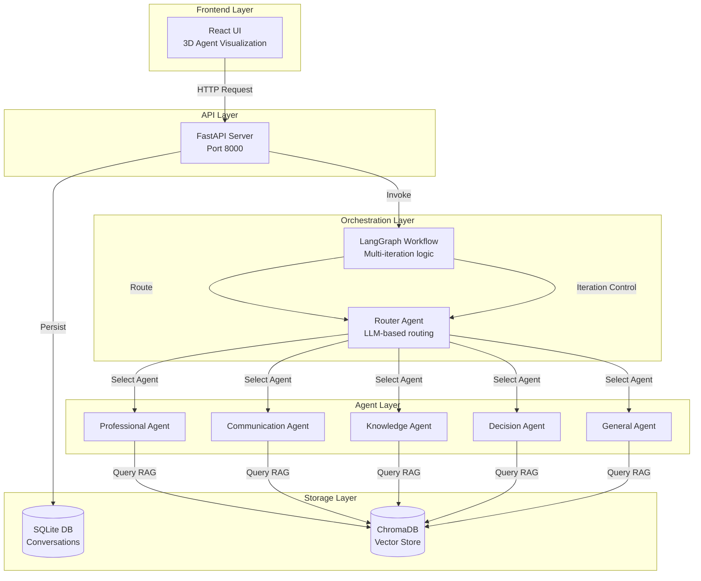

## Component Architecture

### Frontend (React + Three.js)

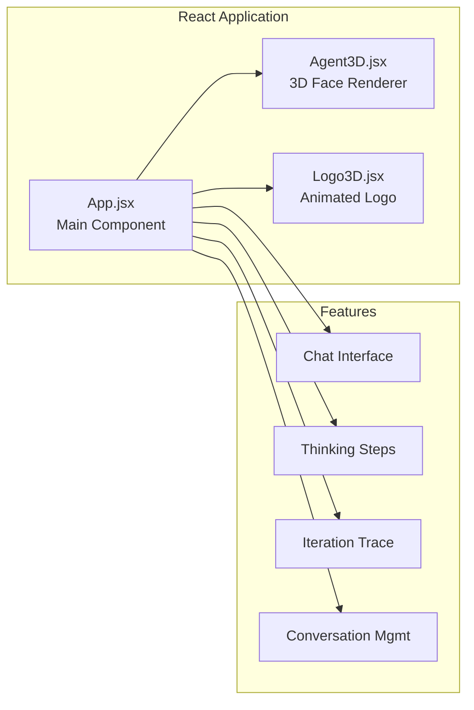

**Key Features:**
- Real-time chat interface with markdown support
- 3D cartoon faces for each agent (Three.js)
- Thinking process visualization
- Detailed iteration trace panel
- Conversation history management

### Backend (FastAPI + LangGraph)

```mermaid
graph TB
    subgraph "API Endpoints"
        ChatAPI[/api/chat<br/>Main endpoint]
        GraphAPI[/api/chat/graph<br/>Direct workflow]
        ConvAPI[/api/conversations<br/>History mgmt]
    end
    
    subgraph "Core Services"
        Workflow[LangGraph Workflow]
        Router[Router Service]
        Agents[Agent Services]
        RAG[RAG Service]
    end
    
    subgraph "Data Access"
        DB[Database Layer]
        Vector[Vector Store]
    end
    
    ChatAPI --> Workflow
    GraphAPI --> Workflow
    ConvAPI --> DB
    
    Workflow --> Router
    Workflow --> Agents
    
    Router --> RAG
    Agents --> RAG
    
    RAG --> Vector
    ChatAPI --> DB
```

## Agent Orchestration Flow

### Router Orchestration Pattern

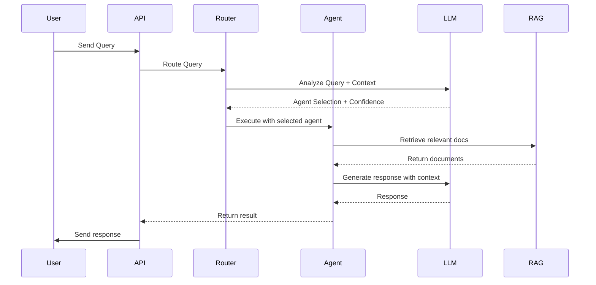

### Agent Selection Logic

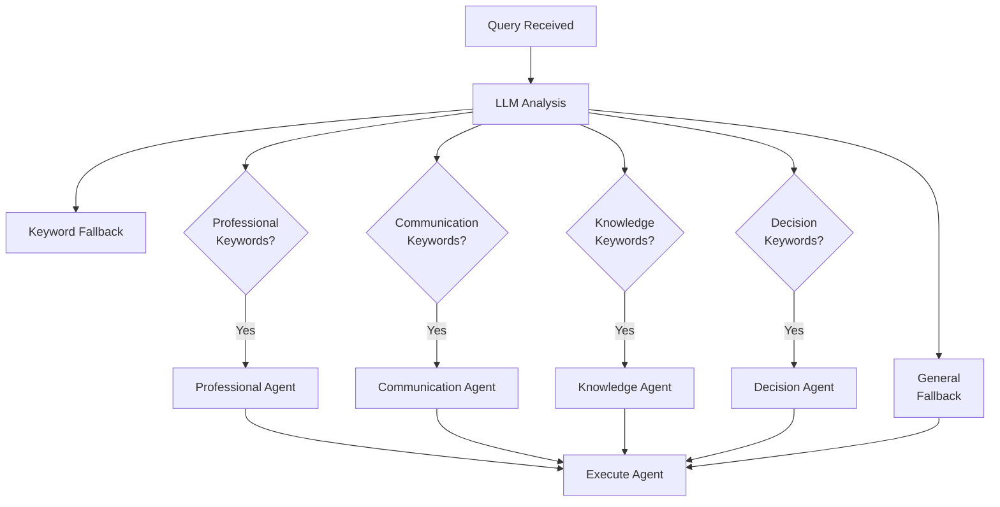

## Multi-Iteration Processing

The system supports iterative refinement through confidence-based retry and continuation signals.

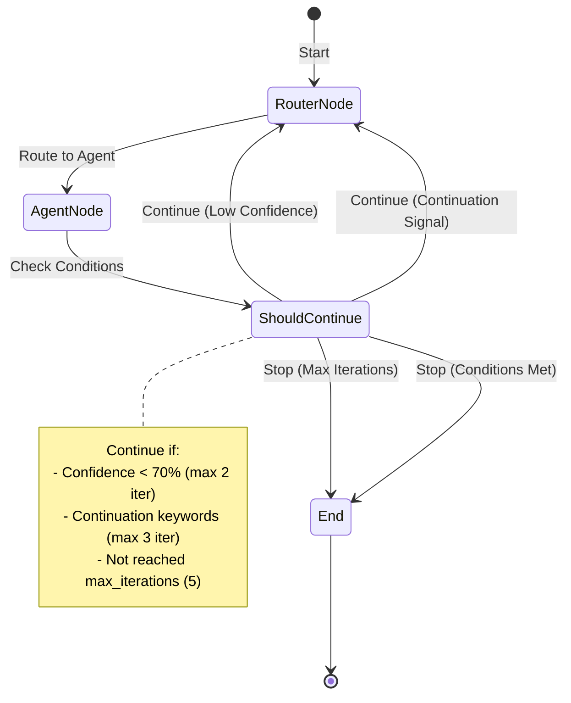

### Iteration Logic

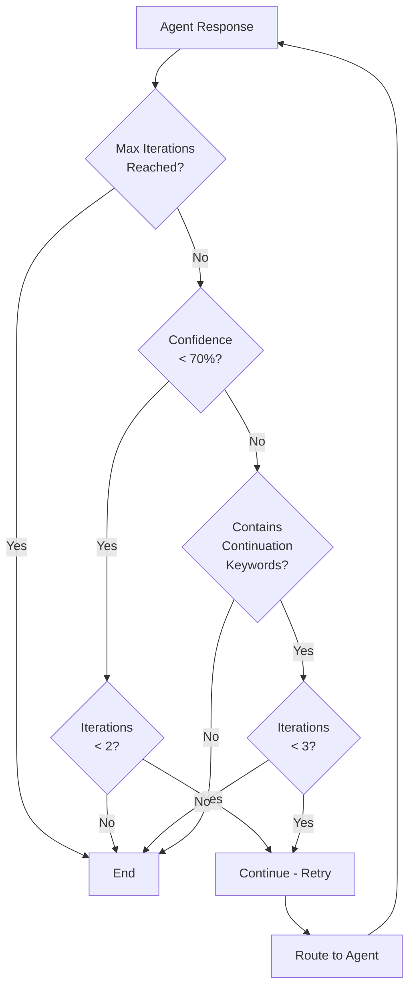

**Continuation Keywords:**
- "let me"
- "I'll also"
- "additionally"
- "furthermore"
- "I can also"
- "would you like"
- "shall i"

## Shared Memory System

All agents share conversation history to maintain context across interactions.

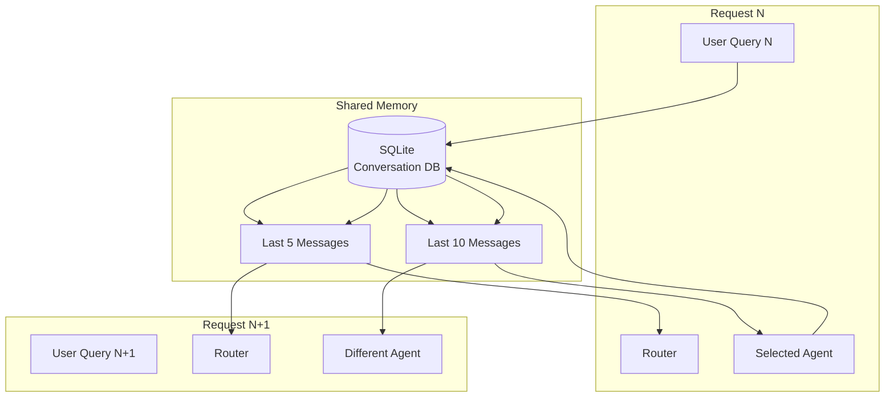

**Memory Scope:**
- **Router**: Last 5 messages (context for routing decisions)
- **Agents**: Last 10 messages (full recent history)
- **Storage**: All messages persisted in SQLite
- **Cross-agent**: Any agent can see messages from all other agents

## Data Flow

### Complete Request Flow

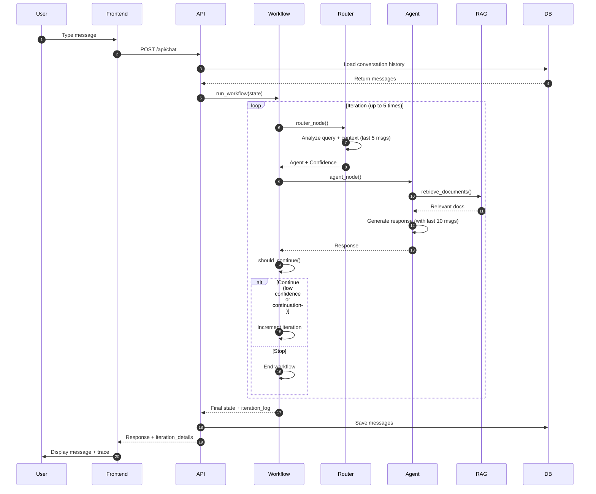

### RAG Query Flow

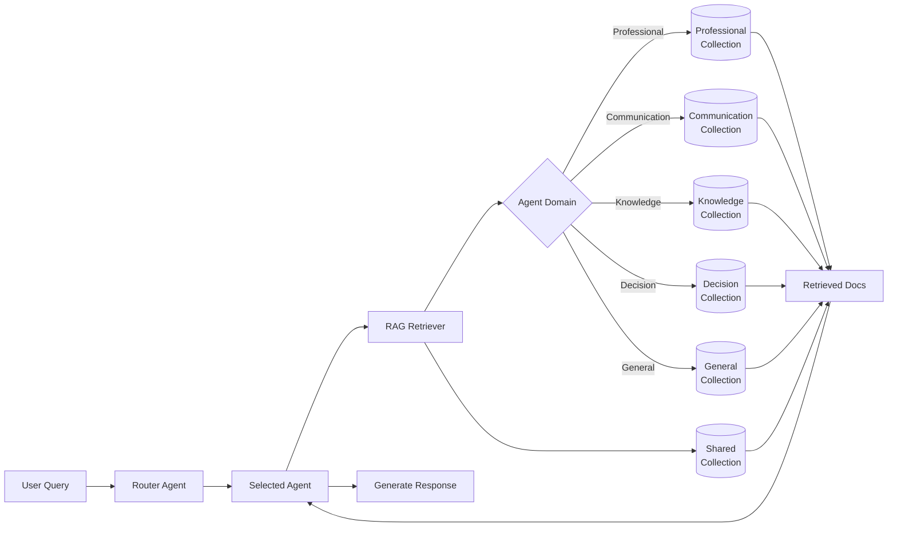

## Technology Stack

### Backend Stack

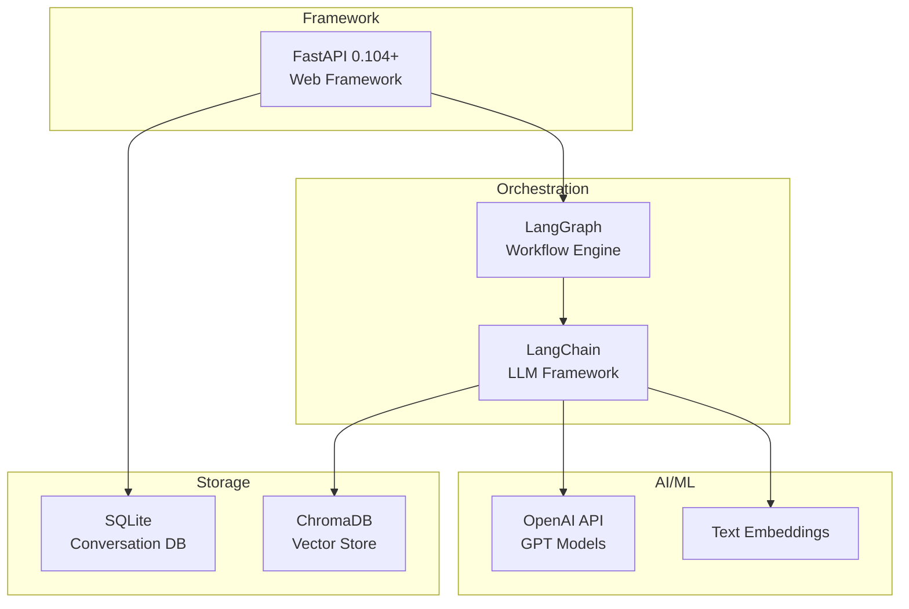

### Frontend Stack

```mermaid
graph TB
    subgraph "Core"
        React[React 19.2<br/>UI Framework]
        Vite[Vite 7.3<br/>Build Tool]
    end
    
    subgraph "3D Rendering"
        Three[Three.js<br/>WebGL Library]
        R3F[@react-three/fiber<br/>React Renderer]
        Drei[@react-three/drei<br/>Helpers]
    end
    
    subgraph "UI Libraries"
        Markdown[react-markdown<br/>Markdown Renderer]
        Syntax[react-syntax-highlighter<br/>Code Highlighting]
        Icons[lucide-react<br/>Icons]
    end
    
    React --> Three
    React --> R3F
    R3F --> Drei
    React --> Markdown
    React --> Syntax
    React --> Icons
```

## Deployment Architecture

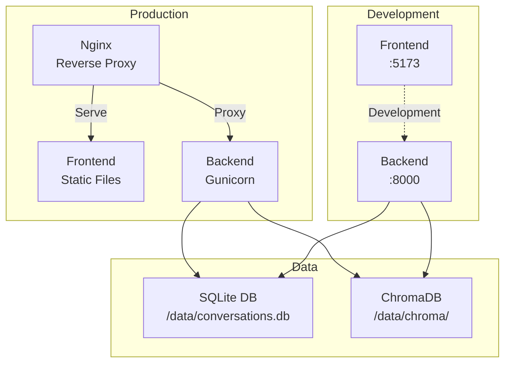

## Key Design Patterns

### 1. Router Pattern
- Single router agent makes all routing decisions
- LLM-based with keyword fallback for reliability
- Context-aware (uses last 5 messages)

### 2. Multi-Iteration Pattern
- Automatic retry on low confidence
- Continuation on detected signals
- Maximum 5 iterations per request

### 3. Shared Memory Pattern
- All agents see full conversation history
- No memory isolation between agents
- Context-aware routing and responses

### 4. RAG Pattern
- Each agent has isolated document collection
- Shared collection accessible to all
- Retrieval before generation

## Performance Considerations

- **Iteration Limit**: Max 5 iterations prevents infinite loops
- **Context Window**: Last 10 messages keeps token usage manageable
- **Async Processing**: FastAPI handles concurrent requests
- **Vector Search**: ChromaDB provides fast similarity search
- **Caching**: React hot reload for fast development

## Security & Configuration

- Environment variables for API keys
- CORS configuration for frontend
- Database path configuration
- Adjustable iteration limits
- Confidence thresholds

## Future Enhancements

Potential areas for expansion:
- Additional orchestration patterns (sequential, hierarchical)
- Dynamic agent registration
- Multi-modal support (images, audio)
- Real-time streaming responses
- Agent performance metrics
- Custom RAG domains per user
