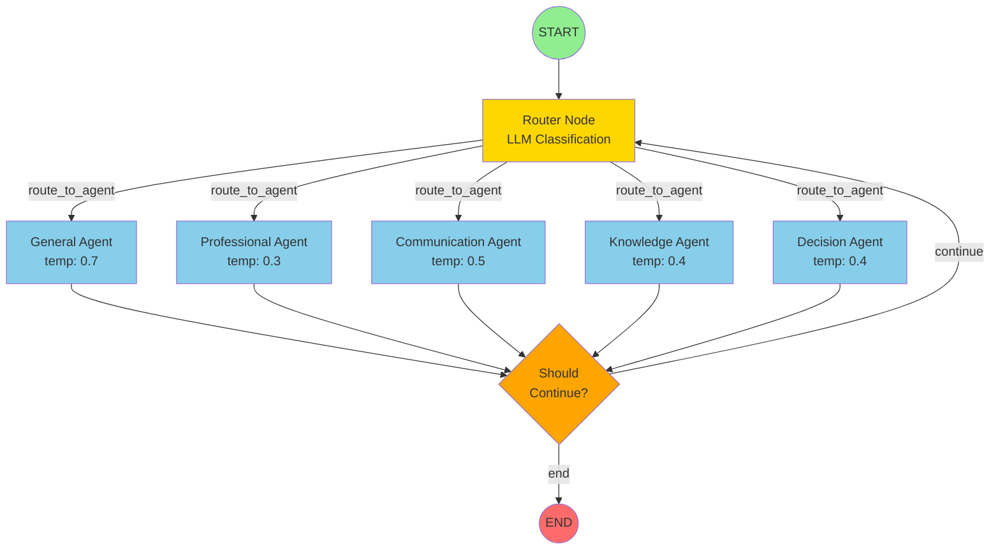

# 🔀 StateGraph Flow Visualization

## Current Implementation (Phase 4)
```
User Request
     ↓
[FastAPI Endpoint]
     ↓
[Router Agent] → Analyzes query with LLM
     ↓
[Agent Selection] → Routes to one of 5 agents
     ↓
[Specialized Agent] → Generates response
     ↓
[API Response]
```
**Flow:** Linear, hardcoded in `app/api/routes.py`  
**Limitation:** Single-turn, no agent-to-agent communication

---

## Planned StateGraph (Phase 5)
```
                    START
                      ↓
              ┌───────────────┐
              │ Router Node   │ ← Entry point
              │ (LLM routing) │
              └───────┬───────┘
                      ↓
        ┌─────────────┴─────────────┐
        │  Conditional Edges        │
        │  (Based on routing        │
        │   decision in state)      │
        └─┬────┬────┬────┬────┬─────┘
          ↓    ↓    ↓    ↓    ↓
     ┌────┐  ┌────┐  ┌────┐  ┌────┐  ┌────┐
     │Gen │  │Pro │  │Com │  │Know│  │Dec │
     │eral│  │fess│  │muni│  │ledg│  │isio│
     │    │  │iona│  │cati│  │e   │  │n   │
     └─┬──┘  └──┬─┘  └──┬─┘  └──┬─┘  └──┬─┘
       └────────┴───────┴───────┴───────┘
                      ↓
              ┌───────────────┐
              │ Should        │
              │ Continue?     │
              └───────┬───────┘
                      ↓
           ┌──────────┴──────────┐
           ↓                     ↓
     [Loop back to          [END Node]
      Router Node]          Response
      (Multi-turn)
```

**Flow:** Graph-based, declarative workflow  
**Benefit:** Multi-turn conversations, agent handoffs

---

## StateGraph Node Definitions

### 1. **START Node** (Built-in)
- Entry point for workflow
- State initialized with user message

### 2. **Router Node** 
```python
def router_node(state: AgentState) -> AgentState:
    """Routes to appropriate agent based on latest message"""
    latest_message = state["messages"][-1].content
    agent, confidence, reasoning = router_agent_with_fallback(latest_message)
    
    # Update routing decision in state
    return update_routing(state, agent, confidence, reasoning)
```

### 3. **Conditional Edge**
```python
def route_to_agent(state: AgentState) -> str:
    """Returns next node name based on routing decision"""
    return state["routing_history"][-1].target_agent
```

### 4. **Agent Nodes** (5 specialized agents)
```python
# Each agent is a node
graph.add_node("general", general_agent)
graph.add_node("professional", professional_agent)
graph.add_node("communication", communication_agent)
graph.add_node("knowledge", knowledge_agent)
graph.add_node("decision", decision_agent)
```

### 5. **Should Continue Decision**
```python
def should_continue(state: AgentState) -> str:
    """Decides if workflow should continue or end"""
    if state["iterations"] >= state["max_iterations"]:
        return "end"
    if not state["should_continue"]:
        return "end"
    return "continue"  # Loop back to router for multi-turn
```

### 6. **END Node** (Built-in)
- Returns final state
- Response extracted and sent to user

---

## Example: Multi-Turn Conversation Flow

**Query:** "Should I learn Rust or Go for backend development?"

```
[START] → User: "Should I learn Rust or Go?"
   ↓
[Router] → Routes to: decision_agent (confidence: 0.85)
   ↓
[Decision Agent] → Response: "Let me analyze both..."
   ↓                Asks: "What's your primary goal: performance or ecosystem?"
   ↓
[Should Continue?] → YES (state["should_continue"] = True)
   ↓
[Router] → User: "I care more about performance"
   ↓        Routes to: professional_agent (0.90)
   ↓
[Professional Agent] → "Given performance focus, here's why Rust..."
   ↓
[Should Continue?] → NO (query resolved)
   ↓
[END] → Return final response
```

**Iterations:** 2  
**Agents Used:** decision → professional

---

## Visual StateGraph Structure



---

## Key Differences: Current vs StateGraph

| Aspect | Current (Phase 4) | StateGraph (Phase 5) |
|--------|-------------------|----------------------|
| **Architecture** | Sequential function calls | Graph with nodes & edges |
| **Turns** | Single turn only | Multi-turn conversations |
| **Agent Handoff** | Not possible | Agents can pass to other agents |
| **Visualization** | Code-only | Visual graph representation |
| **Debugging** | Print statements | LangGraph Studio + tracing |
| **Loops** | Manual implementation | Built-in with conditional edges |
| **State Flow** | Implicit (function params) | Explicit (graph edges) |

---

## Benefits of StateGraph

1. **Visual Understanding** 
   - See entire conversation flow as a graph
   - Identify bottlenecks and optimization points

2. **Multi-Turn Conversations**
   - Agents can ask clarifying questions
   - Complex queries broken into steps

3. **Agent Collaboration**
   - Decision agent can hand off to Professional agent
   - Knowledge agent can verify facts, then pass to Communication agent

4. **Better Debugging**
   - LangGraph Studio shows exact path taken
   - State checkpointing at each node

5. **Production Features**
   - Automatic retry on node failures
   - Timeout handling per node
   - State persistence between runs

---

## Code Example: Building the StateGraph

```python
from langgraph.graph import StateGraph, END

# Create the graph
workflow = StateGraph(AgentState)

# Add nodes
workflow.add_node("router", router_node)
workflow.add_node("general", general_agent)
workflow.add_node("professional", professional_agent)
workflow.add_node("communication", communication_agent)
workflow.add_node("knowledge", knowledge_agent)
workflow.add_node("decision", decision_agent)

# Set entry point
workflow.set_entry_point("router")

# Add conditional edges from router to agents
workflow.add_conditional_edges(
    "router",
    route_to_agent,  # Function returns next node name
    {
        "general": "general",
        "professional": "professional",
        "communication": "communication",
        "knowledge": "knowledge",
        "decision": "decision",
    }
)

# Add edges from agents to continue check
for agent in ["general", "professional", "communication", "knowledge", "decision"]:
    workflow.add_conditional_edges(
        agent,
        should_continue,
        {
            "continue": "router",  # Loop back for multi-turn
            "end": END
        }
    )

# Compile the graph
app = workflow.compile()

# Use it
result = app.invoke(initial_state)
```

---

## Next Steps (Phase 5)

1. Create `app/orchestration/graph.py` with StateGraph definition
2. Update API endpoint to use compiled graph instead of direct function calls
3. Add proper node functions (router_node, should_continue)
4. Test multi-turn conversation scenarios
5. Visualize graph with LangGraph Studio (optional)

**Status:** ⏳ Not yet implemented (Phase 5 pending)
