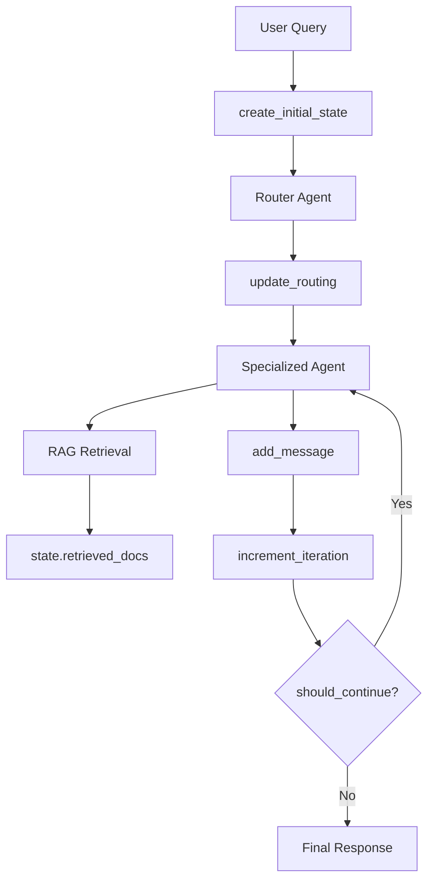

# State Management in Agentic Systems - Best Practices

## 🎯 The Challenge

From your `Agentic-AI-Theory.md`:
> **State Management (El Sistema Nervioso)** - Mantener el contexto compartido entre agentes para evitar pérdida de información.

State management is the "nervous system" of your agent orchestration. It's difficult because:
1. **Multiple agents** need to share context
2. **Asynchronous execution** requires careful synchronization
3. **Iterative loops** must track progress without conflicts
4. **Memory grows** with conversation length

## 🏗️ Common Practices in LangGraph

### 1. **TypedDict with Annotated Reducers** (Our Approach)

**What We Did:**
```python
from typing import TypedDict, Annotated
from operator import add

class AgentState(TypedDict):
    # ACCUMULATE: Add to list (never replace)
    messages: Annotated[list[Message], add]
    routing_history: Annotated[list[RoutingDecision], add]
    
    # REPLACE: Overwrite previous value
    current_agent: str
    iterations: int
    final_response: Optional[str]
```

**Why This Works:**
- `add` operator = append to list (preserves history)
- No annotation = replace (for single values)
- Type safety with TypedDict
- LangGraph automatically applies reducers

**Best Practice:**
✅ Use `add` for anything that's a log/history
✅ Use replace (default) for current state snapshots
✅ Never manually concatenate lists in agents

---

### 2. **Immutable State Updates** (Functional Pattern)

**What We Did:**
```python
def add_message(state: AgentState, role: str, content: str) -> AgentState:
    state["messages"].append(Message(...))  # Modifies in place
    state["updated_at"] = datetime.now()
    return state  # But returns for chaining
```

**Pattern in Agents:**
```python
def my_agent(state: AgentState) -> AgentState:
    # Read from state
    user_query = state["user_query"]
    
    # Do work
    response = llm.invoke(user_query)
    
    # Update state
    state["messages"].append(Message(role="assistant", content=response))
    state["current_agent"] = "my_agent"
    
    return state  # LangGraph merges this with graph state
```

**Best Practice:**
✅ Always return the state from agent functions
✅ Modify state in place (LangGraph handles copying)
✅ Don't create new state objects (unless explicitly needed)

---

### 3. **Checkpoint Strategy** (Persistence)

LangGraph supports checkpointing for long-running conversations:

```python
from langgraph.checkpoint.memory import MemorySaver
from langgraph.checkpoint.sqlite import SqliteSaver

# Option 1: In-Memory (dev/testing)
memory = MemorySaver()
graph = workflow.compile(checkpointer=memory)

# Option 2: SQLite (production)
checkpointer = SqliteSaver.from_conn_string("./checkpoints.db")
graph = workflow.compile(checkpointer=checkpointer)

# Option 3: Redis (distributed)
from langgraph.checkpoint.redis import RedisSaver
checkpointer = RedisSaver(redis_url="redis://localhost")
graph = workflow.compile(checkpointer=checkpointer)
```

**When to Checkpoint:**
- Between agent transitions
- After expensive operations (RAG retrieval)
- Before/after LLM calls
- At decision points (router)

**Best Practice:**
✅ Use MemorySaver for development
✅ Use SQLite for single-server production
✅ Use Redis for distributed systems
✅ Checkpoint after non-idempotent operations

---

### 4. **State Scope Design**

**Three Levels:**

#### a) **Session State** (Our AgentState)
Lives for entire conversation:
```python
session_id: str
user_id: str
messages: list[Message]
```

#### b) **Agent-Local State** (Not in AgentState)
Lives only within agent execution:
```python
def professional_agent(state: AgentState) -> AgentState:
    # Local variables, not persisted
    temp_results = search_documents(state["user_query"])
    filtered = [r for r in temp_results if r.score > 0.8]
    
    # Only final results go to state
    state["retrieved_docs"] = filtered
    return state
```

#### c) **Global Config** (Settings)
Lives for entire application:
```python
from app.config.settings import settings
settings.default_llm_model  # Never in state
```

**Best Practice:**
✅ Keep state minimal (only shared data)
✅ Use local variables for intermediate work
✅ Don't pollute state with temporary data

---

### 5. **Conditional State Updates**

Only update what changed:

```python
def router_agent(state: AgentState) -> AgentState:
    decision = classify_intent(state["user_query"])
    
    # Only update routing if decision made
    if decision.confidence > 0.7:
        state["next_agent"] = decision.agent
        state["routing_confidence"] = decision.confidence
    else:
        state["next_agent"] = "general"  # Fallback
    
    return state
```

**Best Practice:**
✅ Only update fields that need updating
✅ Don't reset fields unnecessarily
✅ Use conditional logic to preserve state

---

### 6. **State Validation**

Use Pydantic for runtime validation:

```python
from pydantic import BaseModel, Field, field_validator

class RoutingDecision(BaseModel):
    confidence: float = Field(..., ge=0.0, le=1.0)
    
    @field_validator('confidence')
    @classmethod
    def confidence_must_be_valid(cls, v):
        if v < 0 or v > 1:
            raise ValueError('Confidence must be between 0 and 1')
        return v
```

**Best Practice:**
✅ Validate critical fields (confidence, scores)
✅ Use Pydantic models for complex nested data
✅ Catch validation errors early

---

### 7. **State Debugging**

Track state evolution:

```python
class AgentState(TypedDict):
    # ... other fields ...
    
    # Debugging fields
    started_at: datetime
    updated_at: datetime
    iterations: int
    error: Optional[str]
```

**Logging Pattern:**
```python
import logging
logger = logging.getLogger(__name__)

def my_agent(state: AgentState) -> AgentState:
    logger.info(f"Agent: {state['current_agent']}, Iteration: {state['iterations']}")
    logger.debug(f"State keys: {list(state.keys())}")
    
    # ... do work ...
    
    return state
```

**Best Practice:**
✅ Add timestamps to track performance
✅ Add iteration counter for loop safety
✅ Log state transitions
✅ Use LangSmith for visualization

---

## 🔄 State Flow in Our System



---

## 📊 Common Anti-Patterns

### ❌ Anti-Pattern 1: Replacing Accumulative Data
```python
# BAD: Loses history
state["messages"] = [new_message]

# GOOD: Appends to history
state["messages"].append(new_message)
```

### ❌ Anti-Pattern 2: Deep Nesting
```python
# BAD: Hard to manage
state["agents"]["professional"]["rag"]["docs"]

# GOOD: Flat structure
state["retrieved_docs"]
state["current_agent"]
```

### ❌ Anti-Pattern 3: Storing Functions/Objects
```python
# BAD: Not serializable
state["llm"] = ChatOpenAI(...)

# GOOD: Store data only
state["llm_model"] = "gpt-4o-mini"
# Get LLM from factory when needed
llm = get_llm(model=state["llm_model"])
```

### ❌ Anti-Pattern 4: No Safety Limits
```python
# BAD: Infinite loop possible
while not done:
    state = agent(state)

# GOOD: Safety counter
while state["should_continue"] and state["iterations"] < MAX:
    state = increment_iteration(state)
    state = agent(state)
```

---

## 🎓 Advanced Patterns

### 1. **State Branching** (Parallel Agents)
```python
from langgraph.graph import StateGraph

workflow = StateGraph(AgentState)

# Both agents run in parallel with same input state
workflow.add_node("agent_a", agent_a)
workflow.add_node("agent_b", agent_b)
workflow.add_node("merge", merge_results)

workflow.add_edge("router", "agent_a")
workflow.add_edge("router", "agent_b")
workflow.add_edge("agent_a", "merge")
workflow.add_edge("agent_b", "merge")
```

### 2. **State Filtering** (Agent-Specific Views)
```python
def get_agent_context(state: AgentState, agent_name: str) -> dict:
    """Get only relevant state for specific agent"""
    return {
        "user_query": state["user_query"],
        "messages": state["messages"][-5:],  # Last 5 only
        "retrieved_docs": [
            d for d in state["retrieved_docs"] 
            if d.agent_domain == agent_name
        ]
    }
```

### 3. **State Compression** (Long Conversations)
```python
def compress_old_messages(state: AgentState) -> AgentState:
    """Compress old messages to save memory"""
    if len(state["messages"]) > 20:
        old_msgs = state["messages"][:-10]
        summary = summarize_messages(old_msgs)
        
        state["messages"] = [
            Message(role="system", content=f"Previous: {summary}"),
            *state["messages"][-10:]  # Keep last 10
        ]
    
    return state
```

---

## 🚀 Recommended Setup for Production

```python
from langgraph.graph import StateGraph
from langgraph.checkpoint.sqlite import SqliteSaver
from app.orchestration.state import AgentState, create_initial_state

# 1. Create workflow with checkpointing
checkpointer = SqliteSaver.from_conn_string("./data/checkpoints.db")
workflow = StateGraph(AgentState)

# 2. Add agents
workflow.add_node("router", router_agent)
workflow.add_node("professional", professional_agent)
# ... more agents ...

# 3. Define edges
workflow.add_conditional_edges(
    "router",
    should_continue,
    {
        "professional": "professional",
        "general": "general",
        "end": END
    }
)

# 4. Compile with checkpointer
graph = workflow.compile(checkpointer=checkpointer)

# 5. Run with config
config = {"configurable": {"thread_id": session_id}}
result = graph.invoke(
    create_initial_state(user_query),
    config=config
)
```

---

## 📚 Resources

1. **LangGraph Docs**: https://langchain-ai.github.io/langgraph/
2. **Our Theory Doc**: `Agentic-AI-Theory.md` (Section 5.1: State Management)
3. **Our Implementation**: `app/orchestration/state.py`
4. **Working Example**: `scripts/example_state.py`

---

## ✅ Summary: What We're Doing Right

✅ Using TypedDict with Annotated reducers
✅ Pydantic validation for type safety
✅ Helper functions for common operations
✅ Safety limits (max_iterations)
✅ Timestamps for debugging
✅ Flat structure (not deeply nested)
✅ Accumulative history (messages, routing)
✅ Replace for current values (current_agent, iterations)

**Next:** Apply these patterns when implementing agents in Phase 3!
